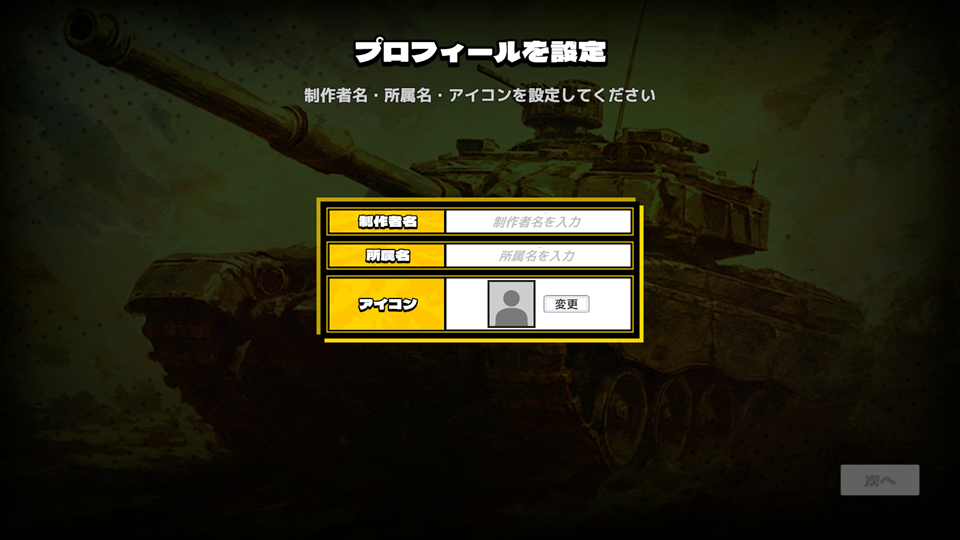
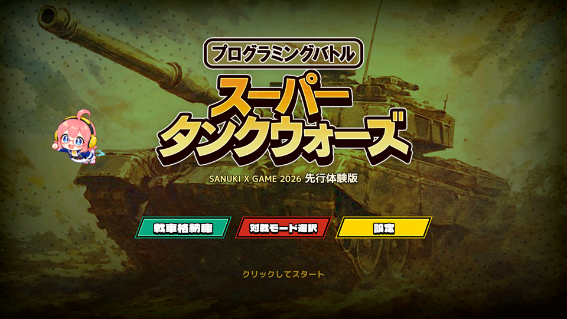
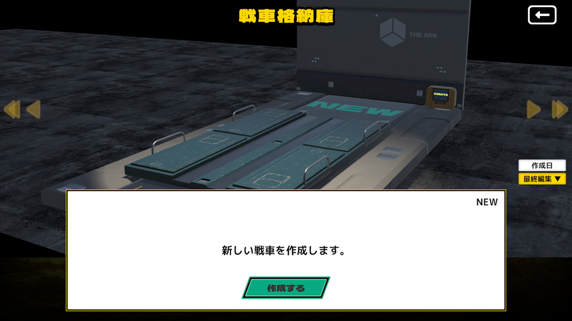
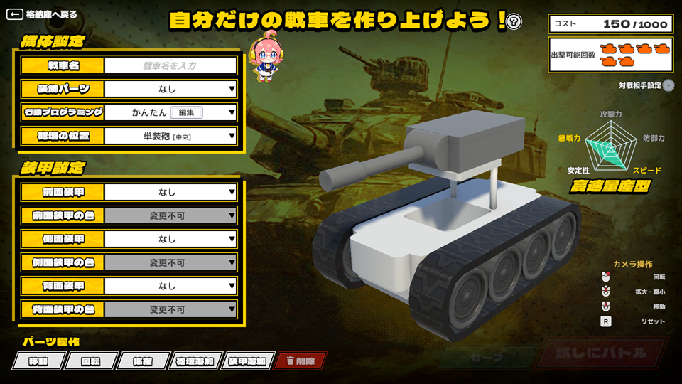
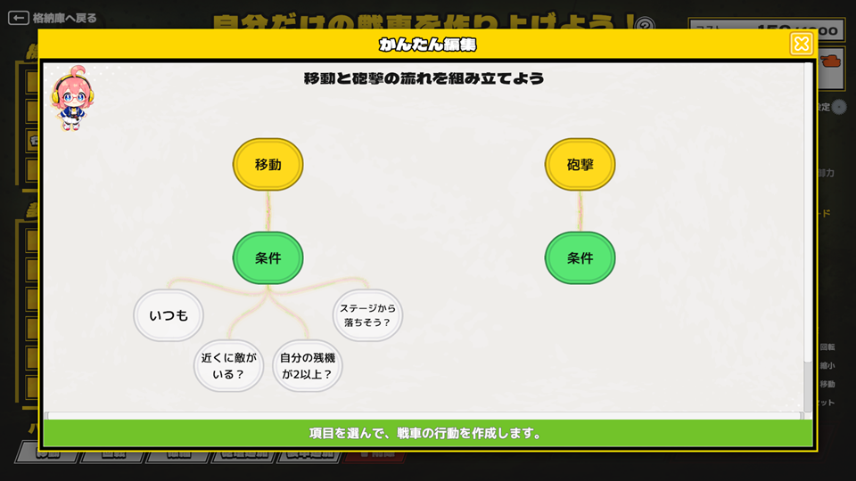
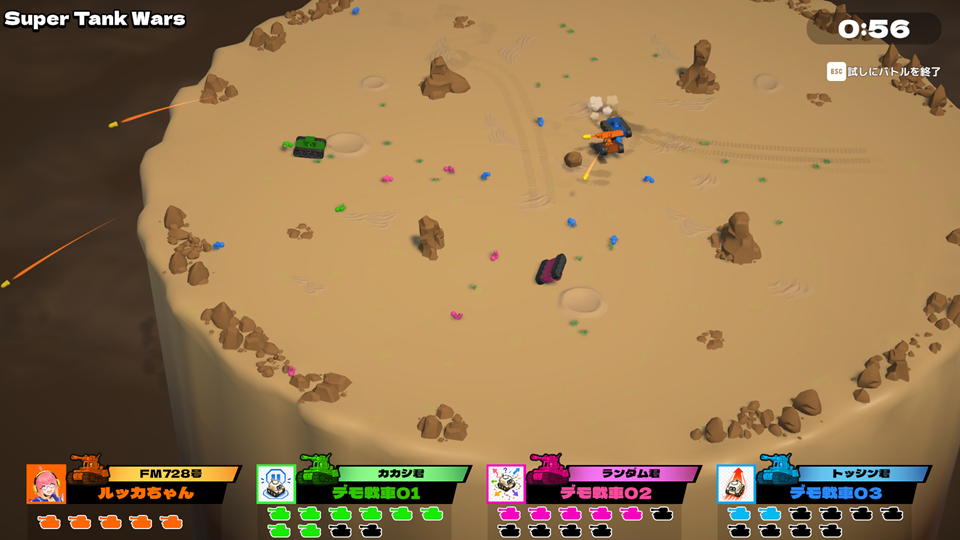
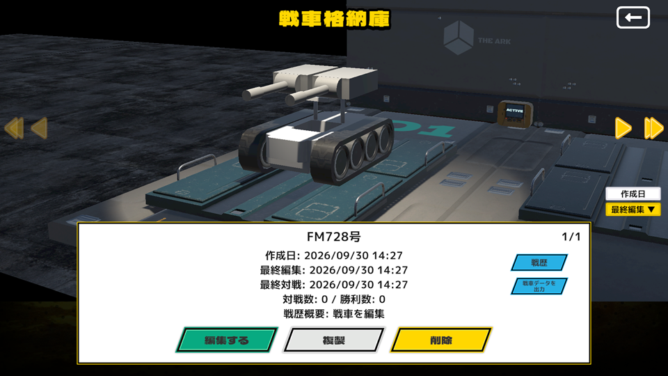
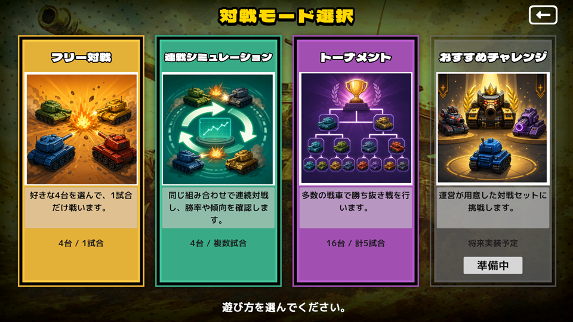
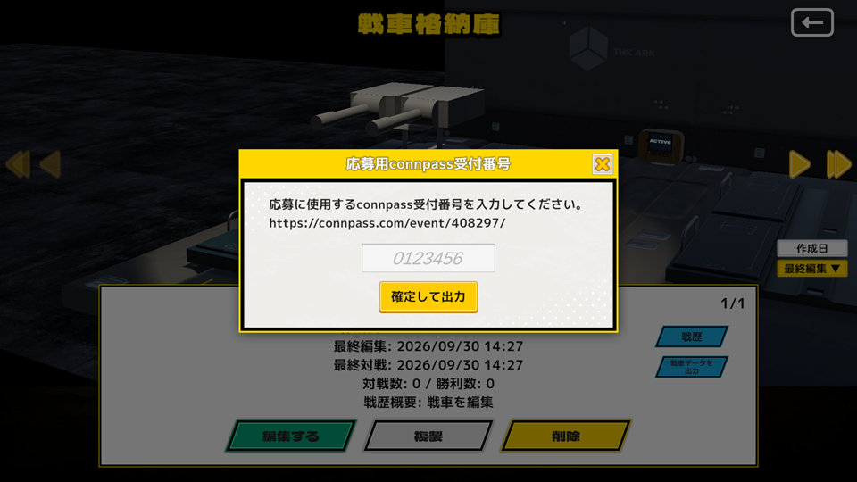

# ゲーム版：ダウンロード・戦車作成・提出ガイド（SXG2026）

ゲーム版では、Unityやプログラミングの知識がなくても、パーツや行動を選んで自分の戦車を作れます。

作った戦車で対戦を楽しむほか、提出用ZIPを出力して、SXG2026「スーパータンクウォーズ」に参加できます。

まずは戦車を1台作り、試合で動きを確かめてみましょう。戦車の編集と対戦を繰り返しながら、自分だけの戦車に仕上げてください。

**提出先・提出方法は後日、[connpassのイベントページ](https://connpass.com/event/408297/)でお知らせします。** 先にエントリーと戦車の制作を進め、出力した提出用ZIPは、提出先の発表まで保管してください。

> このページはゲーム版で制作する方向けのガイドです。
> Unityプロジェクトで制作する場合は、[AI作成手順](README_HowToCreate.md)をご覧ください。

## 📥 1. ゲーム版をダウンロードして起動する

以下の公開フォルダから、ゲーム版をダウンロードしてください。

[SXG2026向けゲーム版をダウンロード（Google Drive）](https://drive.google.com/drive/folders/1m00FQ0ofT7j6CGE_SOgozsvLqyQAH3VM)

### 📂 ダウンロード・解凍する

公開フォルダを開き、ゲーム版のZIPファイルを自分のPCにダウンロードしてください。

現在のファイル名は `SuperTankWars_20260930.zip` です。バージョン更新によりファイル名が変わる場合がありますので、公開フォルダ内の最新版をダウンロードしてください。

ダウンロードが終わったら、ZIPファイルを解凍してください。

### ▶️ ゲームを起動する

解凍したフォルダの中にある **`Super Tank Wars.exe`** をダブルクリックすると、ゲームが起動します。

ZIPファイルの中から直接起動せず、必ず解凍してから起動してください。

## 👤 2. 初回起動時の設定をする

初めて起動すると、「制作者名」「所属名」「アイコン」を設定する画面が表示されます。

画面に沿って設定してください。これらは、あとからタイトル画面の「設定」で何度でも変更できます。

  

## 🏠 3. 戦車格納庫を開く

タイトル画面では、「戦車格納庫」「対戦モード選択」「設定」を選べます。

まずは「戦車格納庫」を選んで、自分の戦車を作ってみましょう。

  

最初は自分の戦車がないため、「作成する」を選んで、新しい戦車の編集画面を開いてください。

  

## 🛠️ 4. 戦車を作る

### 📝 戦車名とパーツを設定する

まずは戦車名を入力してください。

続いて、プルダウンから装飾パーツ、砲塔の位置、各種装甲を選んで、戦車の見た目や構成を決めていきます。

画面左下付近に操作説明が表示されているので、確認しながら編集してください。

装甲や砲塔は、クリックして選択すると、パーツ操作欄から移動・回転・拡縮などの操作ができます。

  

**画面右上の「コスト」と「出撃可能回数」にも注目してください。**

パーツの構成によって戦車のコストが変わり、出撃できる回数にも影響します。強さだけでなく、何回出撃できるかも考えながら調整してみましょう。

### 🧠 戦車の行動を設定する

「行動プログラミング」欄の「編集」を押すと、戦車の「移動」と「砲撃」について、条件や動作を選べます。

コードを書く必要はありません。画面上のノードをクリックして、条件や動作をいろいろ試してみてください。

編集が終わったら、右上の「×」ボタンで閉じて、戦車の編集画面に戻ります。

  

### 🧪 「試しにバトル」で動きを確認する

「試しにバトル」を押すと、制作中の戦車を実際の試合で動かして確認できます。

思った方向に移動するか、敵を狙って砲撃できるか、パーツの配置に問題がないかなどを見てみましょう。

**試合中に `Esc` キーを押すと、試合を中断して戦車の編集画面に戻れます。**

気になるところがあれば編集し、もう一度試してみてください。

  

### 💾 セーブして格納庫へ戻る

編集が終わったら、**「セーブ」を押してから**、左上の「格納庫へ戻る」を押してください。

## 🚗 5. 格納庫で戦車を選ぶ・編集する

戦車格納庫には、セーブした自分の戦車が並びます。作った戦車は、何度でも編集できます。

左右にドラッグして戦車を選んだり、新しい戦車を作成したりできます。「戦歴」からは、編集履歴や対戦履歴を確認できます。

タイトル画面に戻るときは、左上の「←」ボタンを押してください。

  

## ⚔️ 6. 対戦モードで遊ぶ

タイトル画面から「対戦モード選択」を選ぶと、3つの対戦モードを選べます。

  

| モード | 内容 |
| --- | --- |
| フリー対戦 | 選んだ4台で、1試合を行います。 |
| 連戦シミュレーション | 選んだ4台で、試合を繰り返します。`Esc` キーで中断できます。 |
| トーナメント | 選んだ16台で、トーナメントを行います。 |

連戦シミュレーションとトーナメントでは、試合中にNumキーの `1`、`2`、`3` を押して、試合の実行速度を速めることができます。

## 🔄 7. 対戦と編集を繰り返して強くする

試合で戦車の動きを見て、気になったところを編集してみましょう。

装甲の配置を変える、砲塔の位置を調整する、移動や砲撃の条件を変えるなど、少しの工夫で戦い方が変わります。

**「戦車を編集する → 試合で試す → さらに編集する」を繰り返して、自分なりの強い戦車を目指してください。**

## 📦 8. 提出用ZIPを出力する

イベントに提出する戦車が決まったら、必要な編集をセーブして、戦車格納庫に戻ってください。

戦車格納庫で提出したい戦車を選び、「戦車データを出力」を押します。

  

受付番号の入力画面が表示されたら、**SXG2026のconnpassで発行された受付番号**を入力してください。入力すると、戦車データのZIPファイルが出力されます。

出力されるファイル名の例：
`SXG2026_Tank_12312312_Player_20260930_111113.zip`

ファイル名の先頭は `SXG2026_Tank_受付番号` です。
自分のconnpass受付番号が入っていることを確認してください。

イベントに参加するには、先に以下のconnpassページからエントリーしてください。

[SXG2026のイベントページ・エントリー（connpass）](https://connpass.com/event/408297/)

<!-- 公開前に追記：
出力されたZIPの保存先、ファイル名、出力完了時の画面表示。
受付番号入力画面のスクリーンショットがあれば追加。
-->

## 📤 9. 締切までに作品を提出する

**提出先・提出方法は後日、[connpassのイベントページ](https://connpass.com/event/408297/)でお知らせします。**

出力されたZIPは、解凍せず、中身を変更せずに、提出先の発表まで保管してください。案内が公開されたら、その方法に従って、ZIPをそのまま提出してください。

**提出するのは、作成した戦車の提出用ZIPです。ゲーム版本体や、ゲーム版のフォルダ全体を提出する必要はありません。**

提出締切：**2026年11月8日（日）23:59**

**connpassへのエントリーや提出用ZIPの出力だけでは、作品の応募は完了しません。締切までに、後日案内する方法で提出する必要があります。**

締切までであれば再提出できます。複数回提出した場合は、**最後に提出されたZIP**を採用します。

提出時の注意事項など、詳しい案内は[戦車の提出手順](README_HowToSubmit.md)をご確認ください。

## ❓ お問い合わせ

不明な点がある場合は、[イベントページ](https://connpass.com/event/408297/)からお問い合わせください。

[トップページへ戻る](../../README.md)