# AI作成手順

## 作成する前に

**connpassでエントリーし、「受付番号」を発行してください。**  
**エントリーせずにAIを提出した場合、無効となります。**

&nbsp;

### 1. connpassで[イベント](https://connpass.com/event/366668/)に参加する

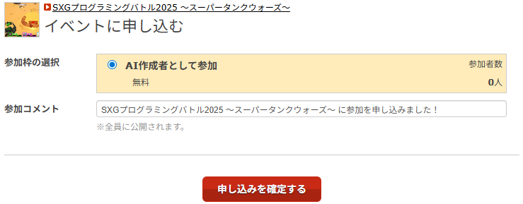


### 2. イベントページの「受付票を見る」ボタンを押す

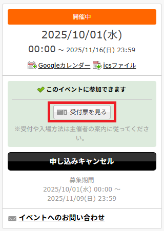

### 3. 受付番号を確認する（7桁）

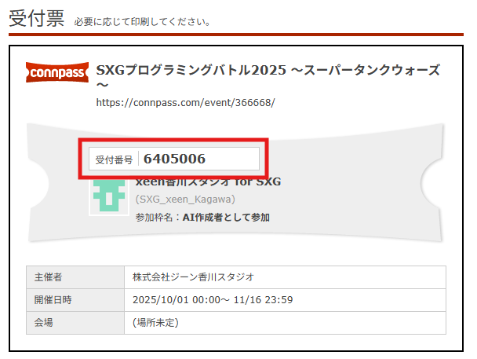

---

## AI新規作成方法

ここからUnityエディタ上での作業になります。<br>
このリポジトリのmainブランチをクローンするかダウンロードして、ローカル環境にUnityプロジェクトを落としてください。  
&nbsp;

Youtubeの動画でも、AI新規作成方法の概要をご確認いただけますので、確認してみてください。<br>
（詳細はReadMeの文面をご確認ください）

▼クリックで動画再生ページへジャンプします。
[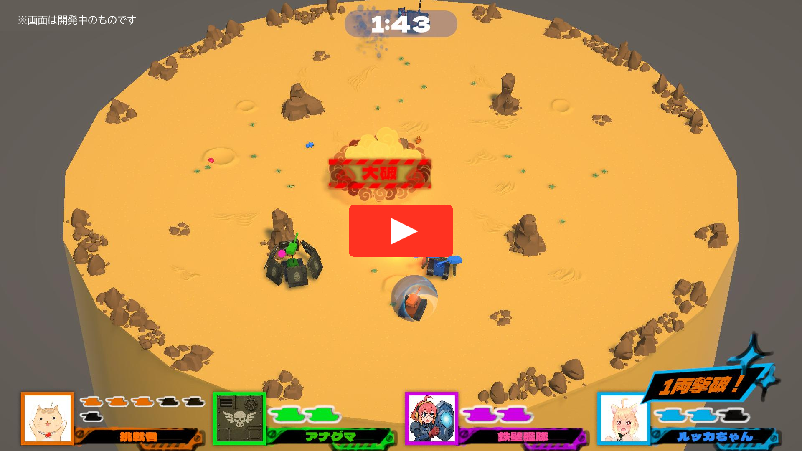](https://youtu.be/Y_IXl3TUv6Q "紹介動画")
<br>※画面は開発中のものです<br>

&nbsp;

### 1. Unity上部メニュー SXG2025 > 挑戦者作成 を選択

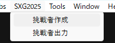

挑戦者作成ウィンドウが開きます。

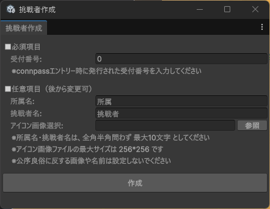

### 2. 各項目を入力

**■必須項目**

- 受付番号： **connpassエントリー時に発行された受付番号** を入力<br>

**■任意項目**

- 所属名：実際に所属している会社名や学校名 or 架空の所属名<br>
- 挑戦者名：本名 or ニックネーム
- アイコン画像選択：アイコン画像ファイル（jpgかpng）を「参照」ボタンから選択（未選択可能）

※所属名・挑戦者名は、全角半角問わず最大10文字としてください。<br>
※アイコン画像ファイルの最大サイズは256*256です。<br>
※公序良俗に反する画像や名前は設定しないでください。<br>

これらの任意項目は、挑戦者登録ウィンドウを閉じた後でも変更可能です。

### 3. 「作成」ボタン押下

各項目を入力し終えて「作成」ボタンを押すと、挑戦者のAIに必要なデータが作成されます。<br>
スクリプトのコンパイルが走るので、挑戦者登録完了のダイアログが出るまでお待ちください。<br>

フォルダ名、各ファイル名は「Player(7桁の受付番号）」で命名されます。<br>

例：受付番号 7777777

```
Assets/
└── Participant/
    └── Player7777777/
        ├── Player7777777.cs
        ├── Player7777777.prefab
        └── Player7777777.png
```

&nbsp;

PrefabのInspectorで、以下の項目を変更できます。<br>
　・所属名（Your Organization）<br>
　・挑戦者名（Your Name）<br>
　・アイコン画像ファイル（Face Image）<br>

 挑戦者作成ウィンドウでアイコン画像ファイルを設定しなかった場合、後から手動で追加してください。<br>
アイコン画像を用意できない場合、サンプルアイコン画像（Assets/GameAssets/Textures/PlayerSampleImage_***.png）を使用しても構いません。

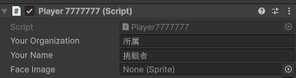

---

## ゲームを実行する

まずは、`Assets/Scenes/Game.unity`を開いてゲームを実行してみてください。<br>

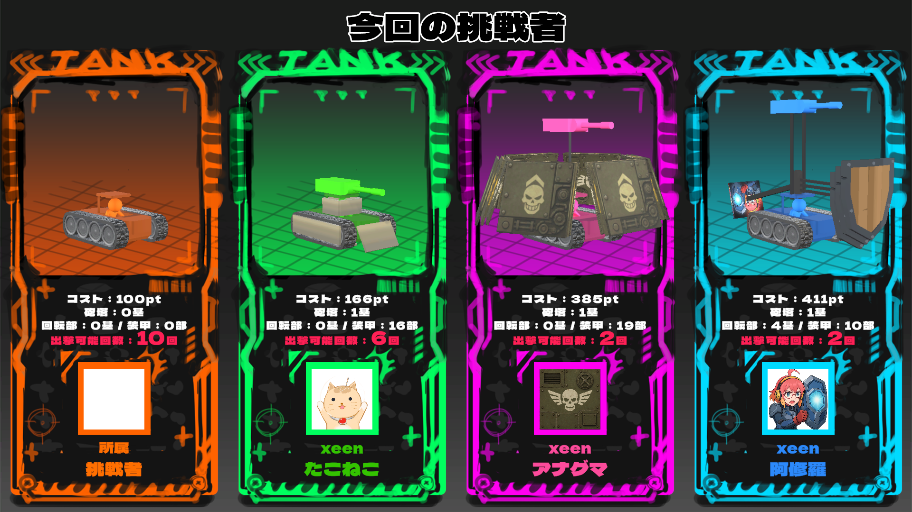

一番左側の戦車が、自身の戦車です。<br>

他の3台の戦車は、弊社が用意したサンプルAIになります。<br>
[リファレンス](README_Reference.md)の『サンプルAI解説』に、サンプルAIの情報を記載しています。<br>
どういう戦略で作成されているか簡単な解説もあるので、コーディングやカスタマイズ時の参考にしてください。<br>
&nbsp;

プロジェクト内に存在する戦車は、`Assets/GameAssets/Data/ParticipantList.asset`でリストで管理されています。<br>
新規AI作成時、自身の戦車がの0番目の要素に登録され、ゲーム内で挑戦者として選択できるようになっています。<br>

ゲーム実行時、`Assets/GameAssets/Data/ParticipantList.asset`の上から4つの要素の挑戦者が戦います。<br>
戦わせる挑戦者を変更したい場合は、リストの順番を並べ替えてみてください。<br>

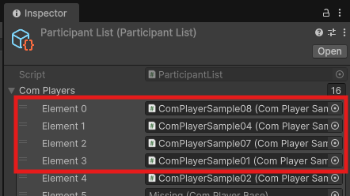

&nbsp;

スペースキーを押すとゲームを進行できます。<br>
このゲームのルールは、[リファレンス](README_Reference.md)の『ゲームルール』をご確認ください。

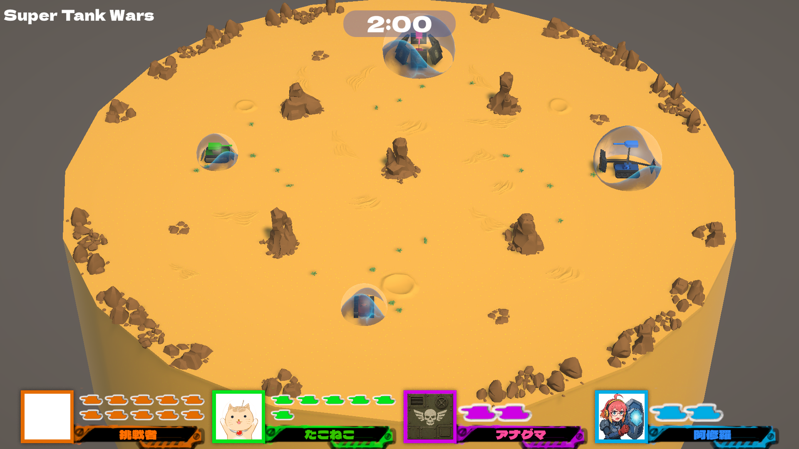

初期状態ではコーディングしていないため戦車は自動で動きませんが、ゲームパッドによる手動操作は可能となっています。<br>
操作は難しいですが、実際にプレイしてみて戦略を練ってみてください。<br>
操作方法は、 [『ゲームパッド操作方法』](README_HowToPlayByGamePad.md) を確認してください。

---

## コーディング＆カスタマイズする

### 1. 戦車の動作をコーディングする

作成されたC#スクリプトを確認してみましょう。<br>
初期状態では、Start、Update関数のみが記入されています。<br>

Update関数内に `SXG_TestPlayByGamepad();` を記述していると、コントローラ操作でゲームをプレイできます。<br>
不要になったらコメントアウトしてください。

[リファレンス](README_Reference.md)の『使用できる関数』を参考にしながら、戦車の移動や砲弾を撃つコードを追加していってください。<br>
もちろん、サンプルAIのコードも参考にしていただけます。

```C#
using System.Collections;
using System.Collections.Generic;
using UnityEngine;
using SXG2025;

namespace Player7777777
{
	public class Player7777777 : ComPlayerBase
	{
		private void Start()
		{

		}

		private void Update()
		{
			// コントローラ操作の検証用コードです
			// 動作検証が終わったらコメントアウトしてください
			SXG_TestPlayByGamepad();
		}
	}
}

```

### 2. 戦車の見た目をカスタマイズする

作成されたPrefabを開いてみましょう。<br>

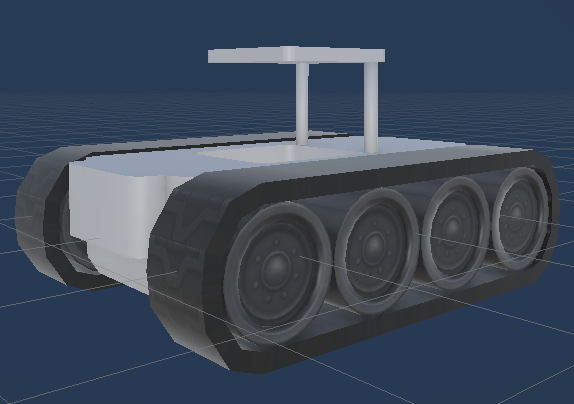

Prefabの編集モードで、自身の戦車に砲塔や装甲を着けてカスタマイズできます。<br>

砲塔や装甲の装着には「コスト」がかかり、それらの総コストが１台の戦車を出撃させるのに必要なコスト「**出撃コスト**」となります。<br>
各プレイヤーは**１試合 1000コスト分 までの戦車を出撃できます。**<br>
つまり、出撃コストが200の場合、１試合の出撃可能回数は５回となります。<br>

初期状態では、戦車にはなんのパーツも付いていません。<br>
何もつけていない初期状態の場合の出撃コストは100です。<br>
[戦車のカスタマイズ方法](README_HowToCustomizeTank.md)を確認しながら、オリジナルの戦車を作っていきましょう！

---

## 【202510/14追加】 挑戦者選択シーン

実行時に戦わせる挑戦者を選択するシーン（`Assets/Scenes/ParticipantSelection.unity`）を追加しました。  

4人の挑戦者を選択すると「出撃」ボタンが押せるようになり、Gameシーンへ遷移します（挑戦者重複OK）。  
他の挑戦者に邪魔されず自分の戦車の挙動がうまくいっているかだけ確認したい場合、他3人を『xeen Gamepad』にして試合開始するのをオススメします。

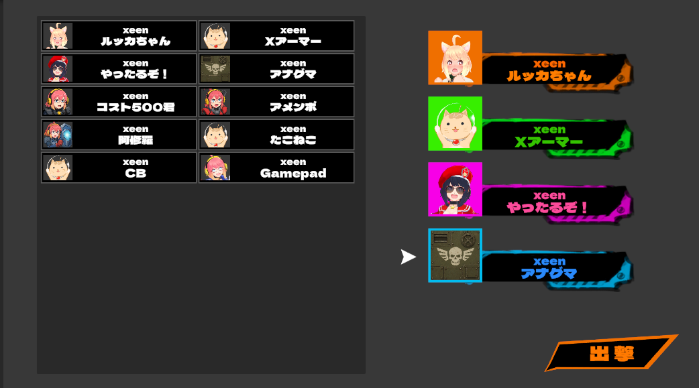

戦わせる挑戦者をこまめに変更したい場合など、`Assets/GameAssets/Data/ParticipantList.asset`のリストの順番を都度並べ替えるのが手間な際は、ParticipantSelectionシーンから起動してください。  
試合終了後は再び挑戦者選択シーンへ戻ってくるため、戦わせる挑戦者を変えて連戦できます。  

固定の挑戦者で戦わせたい場合は、従来通りリストの順番を並べ替えてGameシーンから起動してください。  
試合終了後は再び同じ挑戦者で試合を開始できます。  
