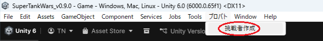
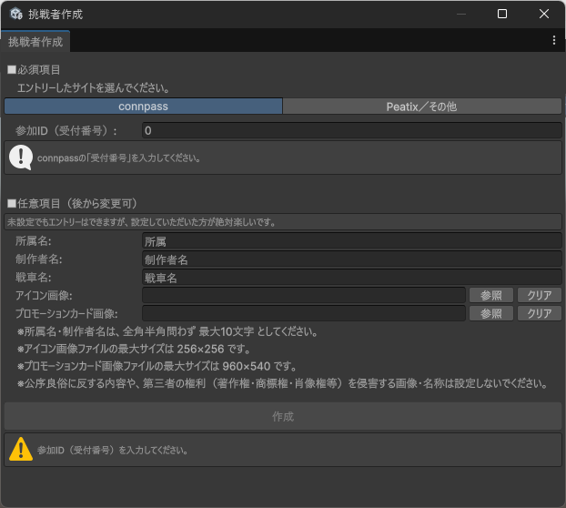

# AI作成手順（TIGS2026）

## 作成する前に

本イベントは、受付番号（参加ID）と紐付けてAIを管理します。  
必ずイベントにエントリーし、受付番号（参加ID）を確認してから作成してください。

- connpassページ：**【後でURLを入れます】**

※Peatix等（connpass以外）でのエントリー方法を用意している場合があります。イベント案内に従ってください。

---

## AI新規作成方法

ここからUnityエディタ上での作業になります。  
GitHubのReleasesからZIPをダウンロードして展開し、Unity Hubでプロジェクトを開いてください。

- Unityバージョン：**Unity 6000.0.65f1**

---

### 1. Unity上部メニューから「挑戦者作成」を開く

Unity上部メニューから、以下を選びます。

- `プロバト/挑戦者作成`

  

挑戦者作成ウィンドウが開きます。

---

### 2. 各項目を入力する

  

**■必須項目**
- エントリーしたサイト（connpass / その他）を選びます。
- 参加ID（受付番号）を入力します。  
  - connpassの場合：受付番号（7桁）を入力します。  
  - その他の場合：参加IDが自動で割り当てられます（必要に応じて再生成できます）。

**■任意項目（後から変更できます）**
- 所属名：会社名・学校名・チーム名など（最大10文字）
- 挑戦者名：本名またはニックネーム（最大10文字）
- アイコン画像：jpg/png（最大256×256、未選択でも可）

---

### 3. 「作成」ボタンを押す

「作成」を押すと、挑戦者（戦車）に必要なデータが作成されます。  
スクリプトのコンパイルが走るため、完了ダイアログが出るまでお待ちください。

作成後、`Assets/Participant/` 配下にフォルダとファイルが作成されます。

フォルダ名の例：
- `Player1234567`
- `PlayerOtr1234567`
※運用上、フォルダ名にニックネーム等が付く場合があります（例：`Player1234567 - 名前`）。

作成されるファイル例：
- `（フォルダ名）.cs`
- `（フォルダ名）.prefab`
- `（フォルダ名）.png`（設定した場合）

---

## 作成した戦車を確認する

作成されたPrefabを開くと、Prefab編集モードで戦車を編集できます。

- 砲塔を追加して位置を調整します。
- 装甲を追加して見た目や防御を整えます。
- 再生して動作を確認します。

カスタマイズの詳しい手順は、[『戦車のカスタマイズ方法』](README_HowToCustomizeTank.md) をご確認ください。

  

---

## ゲームを実行する

まずは、`Assets/Scenes/Game.unity` を開いてゲームを実行してみてください。  
スペースキーでゲームを進行できます。

プロジェクト内に存在する戦車は、`Assets/GameAssets/Data/ParticipantList.asset` でリスト管理されています。  
新規AI作成時、自身の戦車がリストの先頭に登録され、ゲーム内で挑戦者として選択できるようになります。

戦わせる挑戦者を変更したい場合は、リストの順番を並べ替えてみてください。  
また、挑戦者選択シーン（`Assets/Scenes/ParticipantSelection.unity`）を実行すると、戦わせる挑戦者を選択できます。

  

---

## コーディングする（任意）

作成されたC#スクリプトを確認してみましょう。  
使用できる関数は、[『リファレンス』](README_Reference.md) の『使用できる関数』をご確認ください。

また、プログラムが苦手な人や、プログラムのアイデアが欲しい人は、[『かんたんAI作成機能』](README_HowToEasyAI.md) もご利用ください。