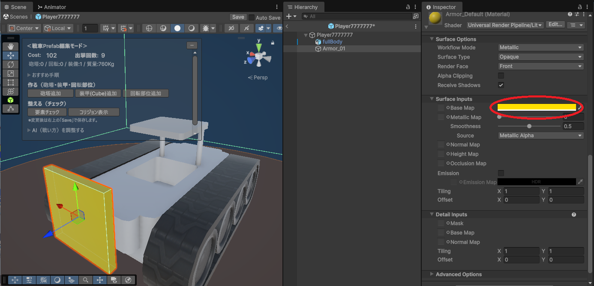
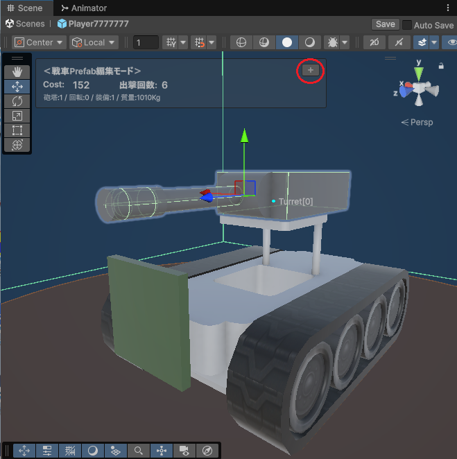
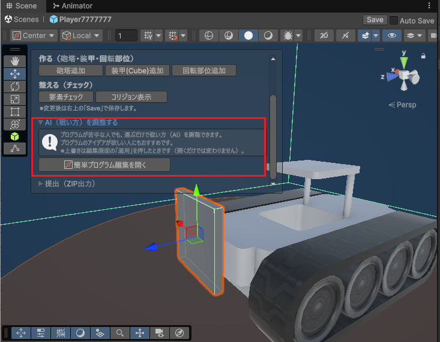

# 戦車のカスタマイズ方法（TIGS2026）

自身の戦車Prefabを開くと、Prefab編集モードで「戦車Prefab編集モードパネル」が表示されます。  
このパネルを使って、戦車に砲塔・装甲・回転部位を追加してカスタマイズできます。

---

## コストと出撃回数について（重要）

砲塔や装甲などの装着には「コスト」がかかり、それらの総コストが1台の戦車を出撃させるのに必要なコスト（出撃コスト）となります。  
各プレイヤーは **1試合 1000コスト分まで** の戦車を出撃できます。

- 出撃コストが200の場合、出撃可能回数は5回です。
- 何もつけていない初期状態の場合の出撃コストは100です。

Prefab編集モードパネル上部に **Cost と 出撃回数** が表示されるので、カスタマイズしながら確認してください。

---

## 砲塔を追加する

Prefab編集モードパネルの「作る」セクションで「砲塔追加」ボタンを押すと、砲塔が追加されます。  
砲塔をつけると、砲弾を発射して他の戦車を攻撃できます。

- 砲塔1基のコストは「50」です。
- 砲塔は0基でも、複数基つけても構いません。
- ※砲塔のスケールは変更しないでください。

追加した砲塔は、スクリプトのインスペクタの「Turrets」のリストにも追加されます。  
スクリプトで砲塔番号を指定する際は、Turretsリストのインデックスを指定してください。

【注意】  
砲塔の子に砲塔を入れている場合、実行時に親の外に作り直されることがあります。  
砲塔の子に装甲など、砲塔以外のオブジェクトを入れている場合、削除されることがあります。  
砲塔の子に装甲などを入れないように注意してください。

---

## 装甲を追加する（ぜひ試してほしい要素です）

装甲を付けると、コストや重量が増える一方で、うまく配置すれば心臓部（コア）を守りやすくなります。  
また、戦車の見た目を作り込めるので、デザイン面でもおすすめです。

### 基本：装甲（Cube）を追加する

Prefab編集モードパネルの「作る」セクションで「装甲追加」ボタンを押すと、装甲用のCubeが追加されます。  
追加されたCubeは、Prefab内で位置・回転・スケールを調整するだけで装甲として使えます。  
追加された装甲（Cube）は `Armor_01` のような名前でPrefab内に作成されます。

  - 装甲の色を変えたい場合は、そのパーツを選んでInspectorの下の方に色を変更する項目があります。お試しください。

### 発展：テクスチャで見た目を整える（任意）

装甲にテクスチャを貼り付けると、戦車がさらに良く見えます。

1. 好きなテクスチャをインポートします。
2. 新規マテリアルを作成します。
3. マテリアルのインスペクタの「Base Map」に、インポートしたテクスチャを割り当てます。
4. Prefab内の装甲（Cube）に、作成したマテリアルを割り当てます。

---

## 3Dモデルパーツを装甲として使う（任意）

Unityプロジェクト内に用意された3DモデルパーツをPrefabに追加して、装甲として使うこともできます。  
例：盾や剣のモデルなど

【注意】  
- SkinnedMeshRendererは装甲として計上されません（見た目は出てもコストや防御に反映されません）。  
- 装甲はPrefabの直下（子）に配置してください。  
- 装甲の子に砲塔・装甲・回転ジョイントを配置しないでください。

---

## 回転部位を追加する（任意）

Prefab編集モードパネルの「作る」セクションで「回転追加（回転部位追加）」を押すと、回転部位が追加されます。  
回転部位を回転させることで、子にした装甲も一緒に回転させられます。

- 回転部位1基のコストは「2」です。
- 回転部位は0基でも、複数基つけても構いません。

追加した回転部位は、スクリプトのインスペクタの「RotJoints」のリストに追加されます。  
スクリプトで回転部位の番号を指定する際は、RotJointsリストのインデックスを指定してください。

---

## 整える（チェック）

Prefab編集モードパネルの「整える」セクションで「要素チェック」を押すと、以下の処理が実行されます。

- PrefabのルートオブジェクトのPositionとRotationを変更している場合、すべて0にリセットします。
- TurretsリストとRotJointsリストの整理（重複している要素とnullの要素を削除）を行います。

【注意】  
未登録の砲塔や回転ジョイントがPrefab内に存在する場合、試合開始時にそれらのオブジェクトが削除されることがあります。  
Prefab内に追加したパーツは、基本的にパネルのボタンから追加することをおすすめします。

---

## 攻撃が当たる部分のコリジョン表示

Prefab編集モードパネルの「コリジョン表示」で、攻撃が当たる部分のコリジョン表示/非表示を切り替えられます。  
半透明の緑色で表示されます。
ここが被弾したら大破となり、残機を１つ失います。

ボタンを押してもコリジョンが表示されない場合は、エディタ上の表示ボタンが有効になっているか確認してください。

---

## 情報ウインドウの最小化

左上に表示される情報ウインドウが邪魔な場合は、このウインドウ右上のボタンを押していただくと最小化できます。  
戻すときはもう一度押してください。  

---

## 取り付け範囲の制限（枠の中に収めてください）

砲塔・装甲・回転パーツを付けられる範囲に制限があります。  
Prefab編集モードで表示される枠が制限範囲です。  
各パーツのMeshRendererが範囲内に収まるように配置してください。

範囲外に出てしまった場合、Prefab編集モード上にエラー文が表示されます。  
違反したオブジェクトは、ゲーム実行時に削除されます。  
また、違反したオブジェクトもコスト計算では計上されているため、削除するか範囲内に収めることをおすすめします。

---

## 戦い方（AI）を調整する（次のステップ）

砲塔や装甲などの配置ができたら、戦車の「戦い方（AI）」を調整できます。  
プログラムが苦手な人や、プログラムのアイデアが欲しい人は「かんたんAI作成機能」を使うとスムーズです。

### 開き方
戦車Prefabを開いたPrefab編集モードで、パネル内の「AI（戦い方）を調整する」から「簡単プログラム編集を開く」を押してください。

### 注意
編集画面で「適用」を行うと、AIスクリプトが上書きされます（開くだけでは変更されません）。  
詳しい使い方は、[『かんたんAI作成機能』](README_HowToEasyAI.md) をご確認ください。

---
