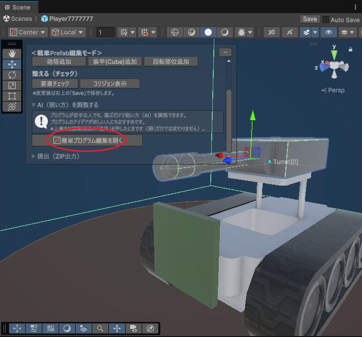
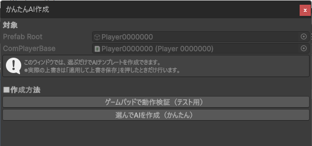
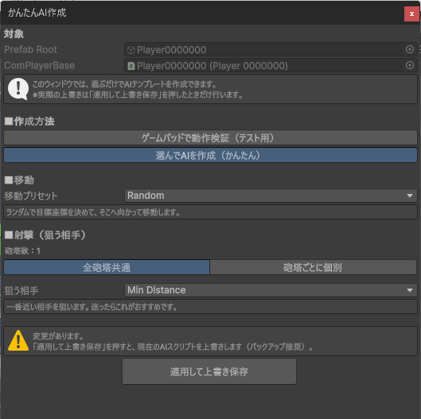
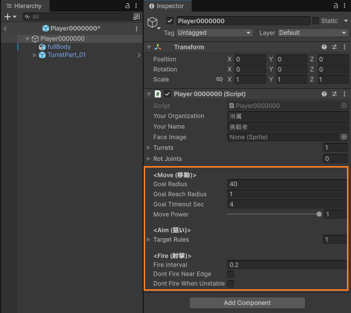
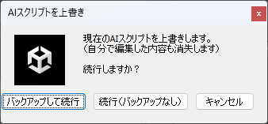

# かんたんAI作成機能（README_HowToEasyAI）

## 概要
「かんたんAI作成機能」は、選ぶだけで戦車の戦い方（AI）を調整できる機能です。  
プログラムが苦手な人や、プログラムのアイデアが欲しい人におすすめです。

---

## 使うタイミング（おすすめ）
先に以下を行ってから、AIの調整に進むのがおすすめです。

1. 砲塔を追加して位置を調整します。
2. 装甲を追加して見た目や防御を整えます。
3. 再生して動作を確認します。

戦車の形ができたら、「戦い方（AI）」を調整して、再生で動きを確認します。  
この流れを繰り返して仕上げていきます。

---

## 開き方
戦車Prefabを開いて **Prefab編集モード** に入ります。  
画面内の「戦車Prefab編集モードパネル」から「かんたんAI作成機能」を開けます。

  

---

## 使い方（基本）
「かんたんAI作成機能」を開くと、最初に次の2つから選びます。

- **ゲームパッドで動作検証（テスト用）**
- **選んでAIを作成（かんたん）**

  

> 注意：この画面で選んだ内容は、最後に「適用して上書き保存」を行うことでAIスクリプトに反映されます。  
> 「ゲームパッドで動作検証（テスト用）」を選んだ場合も、適用するとAIスクリプトが上書きされます。

---

## ゲームパッドで動作検証（テスト用）
作った戦車の重量感や操作感を確認したい場合は、こちらを選んでください。  
このモードでは、デフォルトで **ゲームパッド操作用のAIスクリプト** を生成します。  
最後に「適用して上書き保存」を行うと、現在のAIスクリプトはこの内容で上書きされます。

- 砲塔の向きや弾の出方が意図どおりか
- 装甲を増やした結果、動きが重すぎないか
- 走行できるか／段差で詰まらないか

などを、手早く確認する用途に向いています。

---

## 選んでAIを作成（かんたん）
実際に、選択式でAIプログラムを作成したい場合は、こちらを選びます。  
選ぶと次の画面になります。

  

---

## ■移動 を選びます
移動プリセットから1つ選んでください。  
「戦車がどこへ向かうか」の方針を、選択だけで決められます。

- **Random**：ランダムに目標座標を決めて、そこへ向かって移動します。  
  相手の狙いを外したり、思わぬ方向へ移動したりしますが、動きが安定しにくいこともあります。
- **Rush**：最寄りの敵に近づくことを優先します。  
  近距離戦になりやすいので、近い相手に強い構成（当てやすい砲塔配置など）と相性が良いです。
- **Keep Distance**：すべての敵からなるべく離れる移動をします。  
  被弾しにくく、遠距離で戦える構成と相性が良いですが、攻め切れない展開になることもあります。
- **Orbiting Arena**：闘技場を円形に周回移動します。  
  視界や射線を作りやすく、距離が極端に近づきにくい一方で、相手に動きを読まれやすいこともあります。

※プリセットの細かな挙動は調整される場合があります。最終的には、再生して「動きが好みかどうか」で判断してください。

---

## ■射撃（狙う相手） を選びます
射撃の設定は、「狙う相手」を選ぶ方式です。  
迷ったら **Min Distance（近い相手）** が扱いやすくおすすめです。

- **Min Distance**：一番近い相手を狙います。  
  命中しやすく、判断も分かりやすいので、最初の一歩としておすすめです。
- **Max Energy**：**残り出撃コスト**が一番多い相手を狙います。  
  「まだ余裕があるチーム」や「いま優勢になりやすいチーム」を先に崩したい時に向きます。
- **Min Energy**：**残り出撃コスト**が一番少ない相手を狙います。  
  「いま崩れかけているチーム」を狙って、撃破を積み重ねて押し切りたい時に向きます。
- **In Front**：自分の正面に近い相手を狙います。  
  旋回が少なくて済み、正面に強い砲塔配置と相性が良いです。
- **Behind**：自分の背面に近い相手を狙います。  
  追われやすい状況で反撃したい時や、背面側に強い砲塔配置をしている場合に活きます。

### 「残り出撃コスト」とは？
この値は、戦っている戦車1台のHP（LIFE）ではありません。戦車にHPの概念はありません。  
戦車のコア（中心部分）が被弾すると、その戦車は即大破します（また、ステージ外に落下しても大破します）。  
チームはゲーム開始時にコスト1000を持っていて、戦車が大破するたびに「その戦車のコスト」を支払うため、チームの残りコストが減っていきます。  
この **チームの残りコスト（＝残り出撃コスト）** を元に、Max/Min の判定を行うのが Max Energy と Min Energy です。

砲塔が複数ある場合は、次のどちらかを選べます。
- **すべての砲台に一括で命令をセットする**
- **砲台ごとに個別設定する**

---

## さらに細かく調整したい場合（Inspector）
「かんたんAI作成」でプログラムを生成すると、スクリプトには追加のパラメータが設定されます。  
これらは **Inspector（インスペクタ）** から調整でき、選んだ作戦を自分好みに細かくチューニングできます。

  

> 補足：ここでの調整は「強さを上げる」というより、戦車の形（重さ・砲塔配置）に合わせて「狙いどおり動くように整える」目的で使うのがおすすめです。

### <Move（移動）>：Random の調整項目
- **Goal Radius（目標座標のランダム抽選半径）**：大きいほど広い範囲をうろうろします。
- **Goal Reach Radius（到達判定距離）**：小さいほど「目標地点に近づくまで粘る」動きになります。
- **Goal Timeout Sec（目標再抽選までの時間）**：短いほど目標地点をコロコロ変え、長いほど1つの目標に向かい続けます。
- **Move Power（基本となる移動の強さ）**：大きいほど移動が力強くなります。実際の速度は、戦車の重さが影響します。

### <Move（移動）>：Rush / Keep Distance の調整項目
- **Move Power（基本となる移動の強さ）**：大きいほど加速が強くなり、旋回や押し合いも強引になりやすいです。  
  重い戦車や装甲が多い戦車では、まずここを調整すると変化が分かりやすいです。

### <Move（移動）>：Orbiting Arena の調整項目
- **Move Power（基本となる移動の強さ）**
- **Target Radius（目標移動半径）**：大きいほど外周寄りを回り、小さいほど中央寄りを回ります。
- **Is Clockwise（時計回り？反時計回り？）**：周回方向を切り替えます。

### <Fire（射撃）>：共通の調整項目
どの「狙う相手（TargetRule）」を選んでも、射撃には共通の調整項目があります。

- **Fire Interval（射撃間隔）**：複数の砲台を持っているときに、砲台を順番に撃つ場合の「間隔（秒）」です。  
  `0` の場合は、各砲台がクールタイム明け次第、同時に撃てるなら同時に発射します。  
  `0` より大きい値の場合は、その秒数だけ間隔を空けて、砲台を順番に発射します。  
  ※各砲台にはクールタイムがあるため、この値を小さくしてもクールタイムより速く連射できるわけではありません。
- **Dont Fire Near Edge（外周付近では射撃しない）**：射撃の反動で落下しやすい戦車はONにすると、外周付近で自ら落下してしまう機会が減ります。
- **Dont Fire When Unstable（姿勢が悪いときは射撃しない）**：戦車の姿勢が安定しているときだけ射撃します。  
  転倒しそうなときなどに射撃の反動でさらに姿勢が崩れるのを避けるため、あえて撃たない作戦です。

---

## 適用（上書き保存）とバックアップ
選択が終わったら、「適用して上書き保存」を押すと、AIプログラムが上書き更新されます。  
上書き時に、現在のプログラムをバックアップするかどうかを選択できます。

  

---

## 注意（重要）

### 「適用して上書き保存」を押すと、選んだモードの内容でAIスクリプトが上書きされます
- かんたんAI作成機能は、選択内容からAIコードを生成します。
- **「適用して上書き保存」を行うと、現在のAIスクリプトは上書きされます。**
- 開くだけでは上書きされません。

### 上書き時はバックアップを作成できます
上書き時に、同じフォルダ内の `Backup/` にバックアップを作成できます。  
必要であれば、バックアップから元のファイルに戻せます。

※提出用ZIPには `Backup/` は含めません。

---

## よくある質問

### Q. かんたんAI作成を使うと、C#を書かなくても参加できますか？
参加できます。  
ただし、より細かい挙動にしたい場合はC#での調整も可能です。

### Q. かんたんAI作成を使うと、元のコードに戻せますか？
上書き時に `Backup/` にバックアップを作成できます。  
必要であれば、バックアップを元に戻してください。

### Q. 使える関数（API）を知りたいです
使用できる関数の一覧やゲームルールは、[『リファレンス』](README_Reference.md) をご確認ください。

