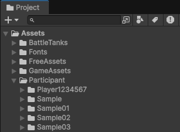
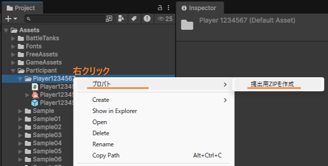

# AI提出手順（TIGS2026）

## はじめに（重要）

提出は、**作成した戦車Prefabが入っているフォルダ**をZIP圧縮して行います。  
**Unityプロジェクト全体をZIP圧縮して提出しないように注意してください。**  
（提出対象が大きくなり、確認ができなくなるためです。）

---

## 提出用ZIPの作成方法（おすすめ）

### 1. `Assets/Participant/` を開く

Projectウィンドウで `Assets/Participant/` を開きます。  
ここに、あなたの戦車フォルダが作成されています。

フォルダ名の例：
- `Player1234567`
- `PlayerOtr1234567`

---

### 2. 戦車フォルダを右クリックして「提出用ZIPを作成」を選ぶ

戦車フォルダを右クリックし、メニューから以下を選びます。

- `プロバト/提出用ZIPを作成`

作成されたZIPは **デスクトップ**に出力されます。  
※ `Backup/` フォルダと `Backup.meta` は提出物に含めません。

---

## 提出用ZIPの作成方法（補助：Prefab編集モードから）

戦車Prefabを開くと、Prefab編集モードの画面内に「提出（ZIP出力）」が表示されます。  
そこから「提出用ZIPを作成」を押すと、同様にデスクトップへZIPが出力されます。

---

## Googleフォームに提出する

提出用Googleフォームへ、作成したZIPファイルを添付して送信してください。

- 提出フォーム：**【後でURLを入れます】**

提出は締め切りまで何度でも可能です。  
本番では、最後に提出されたZIPが採用されます。

---

## 注意事項（提出前にご確認ください）

- 必ずイベントにエントリーし、受付番号（または参加ID）が発行されていることを確認してください。
- アイコン画像サイズは最大256×256です。
- 公序良俗に反する画像や名前は設定しないでください。
- AI作成時にUnityパッケージの追加はできません。
- 提出後、不正や目立った不具合がないか運営側で確認します。

---

## 提出したプログラムに不正や不具合があった場合

運営が想定する動作と異なる挙動や、ゲームのクラッシュに繋がる不具合があった場合、その提出については失格となる可能性があります。  
可能であれば、修正のうえ再提出をお願いします。

運営からの連絡はイベントページ等で行います。

- connpassページ：**https://connpass.com/event/382844/**