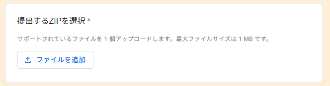
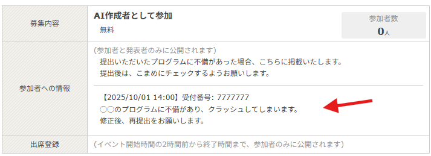

# AI提出手順

## 1. Unity上部メニュー SXG2025 > 挑戦者出力 を選択


挑戦者出力ウィンドウが開きます。


## 2. 各項目を入力

- 受付番号： **connpassエントリー時に発行された受付番号** を入力<br>
- ZIPファイル出力先： 出力先フォルダを指定（未指定の場合、デスクトップに出力されます）

## 3. 「出力」ボタン押下

各項目を入力し終えて「出力」ボタンを押すと、挑戦者のAIデータがZIP圧縮出力されます。<br>

例：受付番号 7777777

```
Assets/
└── Participant/
    └── Player7777777　← このフォルダがZIP圧縮される
```

## 4. GoogleフォームにZIPを提出

[提出用Googleフォーム](https://docs.google.com/forms/d/1lHd5gs5apcTvpgkbw2mZHg5t7E_iDxfNkkhj-uMRVN0/edit)



その他の項目も記入して、送信してください。

Googleフォームの送信は、締め切りまで何度でも可能です。<br>
提出後にプログラムを編集した場合は、再度GoogleフォームにZIPを提出して送信してください。<br>
ただし、本番では最後に提出されたZIPのプログラムが採用されます。

### 注意事項 - 提出前にご確認ください！

- 必ずconnpassでエントリーし、受付番号を発行してください
- 受付番号を間違えないよう注意してください
- アイコン画像サイズは最大256*256とします
- 公序良俗に反する画像や名前は設定しないでください
- AI作成時にUnityパッケージの追加はできません
- AI提出後、不正や目立った不具合が無いか弊社で審査いたします

## 5. 提出したプログラムに不正や不具合があった場合

提出いただいたプログラムに、弊社が想定する動作と異なる挙動や、ゲームのクラッシュに繋がるような不具合があった場合、その提出については失格となります。  
[connpassのイベントページ](https://connpass.com/event/366668/)の「参加者への情報」の欄に、受付番号と不具合の内容を掲載させていただきますので、可能であれば、修正のうえプログラムの再提出をお願いします。  
お手数ですが、AI提出後はページをこまめにチェックするようお願いします。




