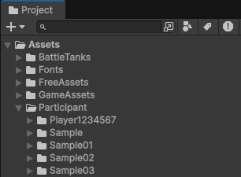
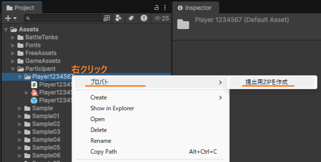

# 戦車の提出手順（SXG2026）

## はじめに（重要）

提出は、**作成した戦車Prefabが入っているフォルダ**を提出用ZIPにして行います。
**Unityプロジェクト全体をZIP圧縮して提出しないように注意してください。**
（提出対象が大きくなり、確認ができなくなるためです。）

Unityを使わずに戦車を制作する配布ビルドを利用した場合も、配布ビルドから出力した提出用ZIPを提出してください。

---

## 提出用ZIPの作成方法（Unityを利用する場合・おすすめ）

### 1. `Assets/Participant/` を開く

Projectウィンドウで `Assets/Participant/` を開きます。
ここに、あなたの戦車フォルダが作成されています。

フォルダ名の例：
- `Player1234567`

---
### 2. 戦車フォルダを右クリックして「提出用ZIPを作成」を選ぶ

戦車フォルダを右クリックし、メニューから以下を選びます。

- `プロバト/提出用ZIPを作成`

作成されたZIPは **デスクトップ**に出力されます。
※ `Backup/` フォルダと `Backup.meta` は提出物に含めません。

独自のモデル・テクスチャ・マテリアル・シェーダーなどを使用した場合は、提出する戦車フォルダ内に必要なファイルが揃っているか、また戦車Prefabの参照が切れていないかを確認してください。

---

## 提出用ZIPの作成方法（Unityを利用する場合・補助：Prefab編集モードから）

戦車Prefabを開くと、Prefab編集モードの画面内に「提出（ZIP出力）」が表示されます。
そこから「提出用ZIPを作成」を押すと、同様にデスクトップへZIPが出力されます。

---

## 提出用ZIPの作成方法（配布ビルドを利用する場合）

Unityを使わずに配布ビルドで戦車を制作した場合は、配布ビルドから提出用ZIPを出力してください。
Unityプロジェクト全体や、提出用ZIP以外のファイルは提出しないでください。

---

## Googleフォームに提出する

提出用Googleフォームへ、作成したZIPファイルを添付して送信してください。

- 提出フォーム：**https://XXX/submission**
- 提出締切：**2026年11月8日（日）23:59**

締切までであれば再提出できます。複数回提出した場合は、**最後に提出されたZIP**を採用します。

---

## 注意事項（提出前にご確認ください）

- connpassのSXG2026イベントにエントリーし、受付番号が発行されていることを確認してください。
- アイコン画像サイズは最大256×256です。
- 公序良俗に反する画像や名前は設定しないでください。
  - 運営チームの審査で不可となった場合は、勝手ながら名前や画像を変更させていただきますのでご了承ください。
- AI作成時にUnityパッケージの追加はできません。
- 提出後、不正や目立った不具合がないか運営側で確認します。

---

## 提出したプログラムに不正や不具合があった場合

運営が想定する動作と異なる挙動や、ゲームのクラッシュに繋がる不具合があった場合、その提出については失格となる可能性があります。
締切までであれば、修正のうえ再提出できます。

運営からの連絡はイベントページ等で行います。

- connpassページ：**https://XXX/connpass**