# リファレンス

## 起動シーン

`Assets/Scenes/Game.unity`を開いてゲームを実行してください。<br>
実行後は、スペースキーでゲームを進行できます。

## ゲームパッド操作

操作したい戦車の、ComPlayerBaseを継承したクラスのUpdate関数内に<br>
`SXG_TestPlayByGamepad();`と記述すると、ゲームパッドでゲームをプレイできます。<br>
操作方法は、 [『ゲームパッド操作方法』](README_HowToPlayByGamePad.md) を確認してください。

## 戦わせる戦車の変更

ゲーム実行時、`Assets/GameAssets/Data/ParticipantList.asset`のリストの、上から4つの戦車が戦います。<br>
戦わせる戦車を変更したい場合は、リストの順番を並べ替えてください。<br>


また、挑戦者選択シーン（`Assets/Scenes/ParticipantSelection.unity`）から起動すると、戦わせる挑戦者を実行時に選択することができます。

## サンプルAI解説

弊社が用意したサンプルAIの情報を記載しています。<br>

- [ルッカちゃん（Assets/Participant/Sample01）](#sample01)
- [Xアーマー（Assets/Participant/Sample02）](#sample02)
- [やったるぞ！（Assets/Participant/Sample03）](#sample03)
- [アナグマ（Assets/Participant/Sample04）](#sample04)
- [コスト500君（Assets/Participant/Sample05）](#sample05)
- [アメンボ（Assets/Participant/Sample06）](#sample06)
- [阿修羅（Assets/Participant/Sample07）](#sample07)
- [たこねこ（Assets/Participant/Sample08）](#sample08)
- [CB（Assets/Participant/Sample09）](#sample09)

## 使用できる関数

コーディング時に使用できる関数の一覧です。<br>

- [SXG_GetCountOfMyTurrets](#func01)
- [SXG_GetCountOfMyRotJoints](#func02)
- [SXG_GetHitObstacles](#func13)
- [SXG_SetCaterpillarPower](#func03)
- [SXG_Shoot](#func04)
- [SXG_CanShoot](#func05)
- [SXG_RotateTurretToDirection](#func06)
- [SXG_RotateTurretToAngle](#func07)
- [SXG_RotateTurretToImpactPoint](#func08)
- [SXG_RotateJointToDirection](#func09)
- [SXG_RotateJointToAngle](#func10)
- [SXG_GetPositionAndRotation](#func11)
- [SXG_GetAllTanksInfo](#func12)
- [SXG_DebugDrawPositionMarker](#func14)

## 戦車のカスタマイズ方法

Prefabの編集モードで、自身の戦車に砲塔や装甲を着けてカスタマイズできます。<br>
カスタマイズ方法については、[戦車のカスタマイズ方法](README_HowToCustomizeTank.md)をご確認ください。<br>

砲塔や装甲の装着には「コスト」がかかり、それらの合計が１台の戦車を出撃させるのに必要なコスト「**出撃コスト**」となります。<br>
**各プレイヤーは１試合 1000コスト分 までの戦車を出撃できます。**<br>
つまり、出撃コストが200の場合、１試合の出撃可能回数は５回となります。<br>
また、何もつけていない初期状態の場合の出撃コストは100です。

## ゲームルール

１試合の所要時間は最大２分。<br>
２分が経過するか、最後の１台になったとき試合終了。  
&nbsp;

戦車カスタマイズで砲塔をつけると砲弾を発射できる。<br>
砲弾の発射には1.5秒のクールタイムがある。  
&nbsp;

シールドが表示されている2秒間は無敵状態。<br>
自身の砲弾の発射も不可。
  
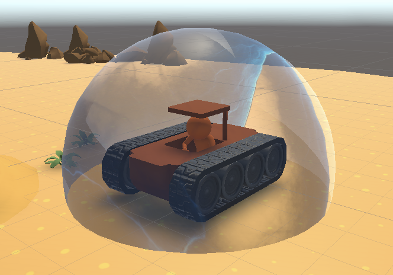

&nbsp;

砲弾が戦車のコア部分（緑色のコリジョン部分）に当たると戦車は撃破される。<br>
撃破されても残機が残っていれば復帰。

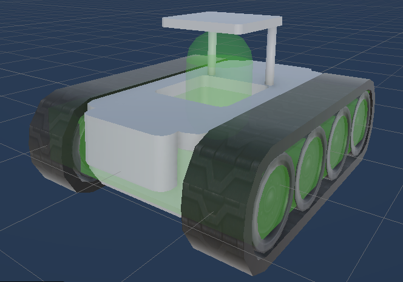

&nbsp;

戦車を撃破すると、**撃破した戦車の出撃コスト分のポイントを獲得。**

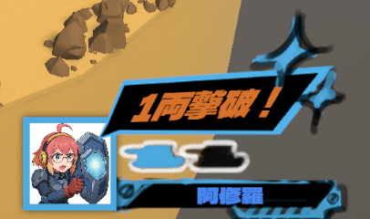

&nbsp;

戦車に装甲をつけていれば砲弾が当たっても耐えられる。<br>
装甲の耐久値が無くなると、その装甲は戦車から剥がれ落ちる。<br>
装甲の耐久値は、装甲の体積（コスト）に比例する。
  
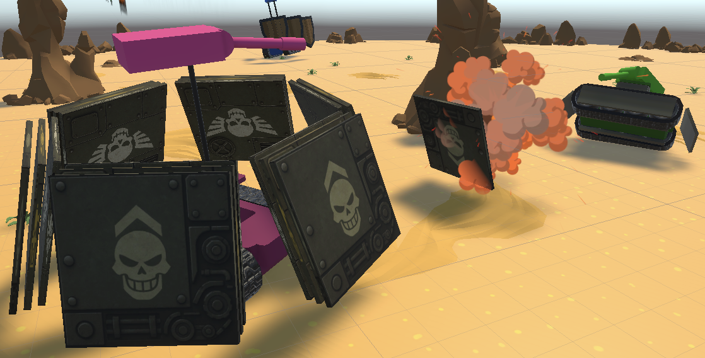

&nbsp;

ステージ中央付近の障害物（岩）に砲弾を当てると、障害物が少しずつ沈んでいく。

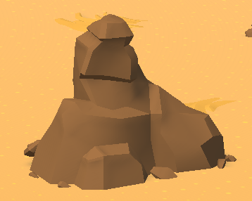

&nbsp;

ステージ外に落下した戦車は大破する。<br>
大破しても残機が残っていれば復帰。  
&nbsp;

リザルトで、**試合終了時の残機×出撃コスト分の残機ボーナスを獲得。**

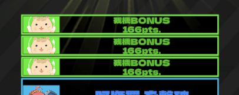

&nbsp;

リザルトで総得点が高かった戦車の勝利！

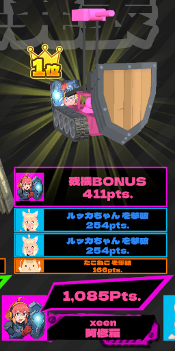

&nbsp;
&nbsp;

---

&nbsp;

## サンプルAI解説

<h3 id="sample01">ルッカちゃん（Assets/Participant/Sample01）</h3>


- 出撃コスト　：254 pts
- 出撃可能回数：３回
- 砲塔数　　　：２基
- 回転部位　　：０基
- 装甲数　　　：５基
- 戦車質量　　：1520 kg

左右と後ろにシールドを設置、かつ、後ろは反動を抑えるための形状で設置。  
ステージをグルグルと周回することを目指して全速力で移動。  
攻撃対象は生存していて自分から最も近い敵を１つ。  
発射はランダムの時間間隔を開けて左右交互に発射。  

---

<h3 id="sample02">Xアーマー（Assets/Participant/Sample02）</h3>

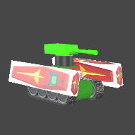

- 出撃コスト　：295 pts
- 出撃可能回数：３回
- 砲塔数　　　：１基
- 回転部位　　：０基
- 装甲数　　　：３基
- 戦車質量　　：1725 kg

左右に厚めのシールドを設置。  
ステージ中央を除くランダムな位置を目指して全速力で移動。  
移動できなくなったら（何かに引っかかってるなら）射撃することで反動を得て移動できる状態にすることを目指す。  
攻撃対象はランダムで選択。  
ランダムな時間間隔を開けて発射。  

---

<h3 id="sample03">やったるぞ！（Assets/Participant/Sample03）</h3>

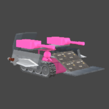

- 出撃コスト　：336 pts
- 出撃可能回数：２回
- 砲塔数　　　：２基
- 回転部位　　：０基
- 装甲数　　　：８基
- 戦車質量　　：1930 kg

前後左右にシールドを設置。左右には剣のモデルを配置、後ろは盾をあしらう。  
ステージをグルグルと周回することを目指して全速力で移動。  
攻撃対象はランダムで選択。  
移動できなくなったら（何かに引っかかってるなら）射撃することで反動を得て移動できる状態にすることを目指す。  
発射はクールタイムが明けたらすぐに発射。  
とにかく、撃てるだけ撃つ。  

---

<h3 id="sample04">アナグマ（Assets/Participant/Sample04）</h3>

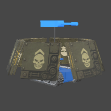

- 出撃コスト　：385 pts
- 出撃可能回数：２回
- 砲塔数　　　：１基
- 回転部位　　：０基
- 戦車質量　　：2175 kg

周囲６方向に薄めを３枚重ねたシールドを設置して全方向からの攻撃を防御することを目指す。  
行動は、ルッカちゃん（Sample01）と同じ。  

---

<h3 id="sample05">コスト500君（Assets/Participant/Sample05）</h3>

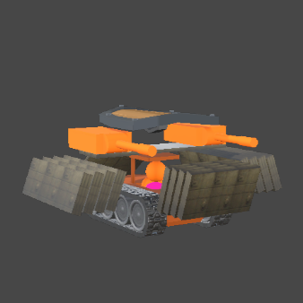

- 出撃コスト　：500 pts
- 出撃可能回数：２回
- 砲塔数　　　：２基
- 回転部位　　：０基
- 装甲数　　　：16基
- 戦車質量　　：2750 kg

前と左右に４枚重ねのシールドを設置して防御を厚く、上面にも盾を配置、後ろは射撃の反動を抑える形でシールドを設置。  
行動は、ルッカちゃん（Sample01）と同じ。  

---

<h3 id="sample06">アメンボ（Assets/Participant/Sample06）</h3>

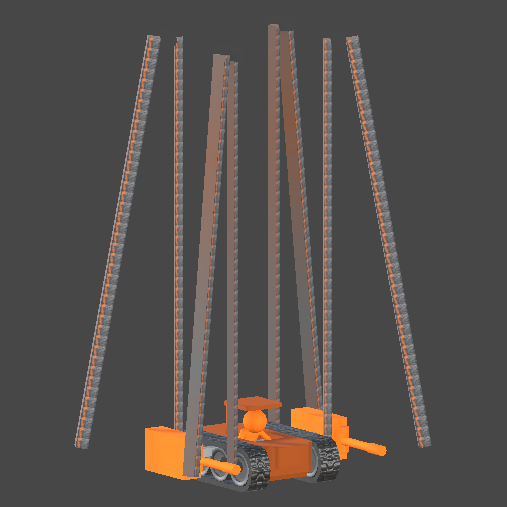

- 出撃コスト　：327 pts
- 出撃可能回数：３回
- 砲塔数　　　：２基
- 回転部位　　：８基
- 装甲数　　　：９基
- 戦車質量　　：1885 kg

回転パーツを使って長あーい４つの足を再現。  
試合が始まったら立ち上がり、上空から他の戦車を狙う。  
４つの足で立ち上がっているので、キャタピラを使った移動はしない。  
攻撃対象は一番近い戦車。  
２つの砲塔からは常に同時に発射することで、姿勢を崩しにくく、かつ、射撃反動で少し浮きがることもできるので、空を飛び続けることもある。  

---

<h3 id="sample07">阿修羅（Assets/Participant/Sample07）</h3>

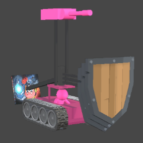

- 出撃コスト　：411 pts
- 出撃可能回数：２回
- 砲塔数　　　：１基
- 回転部位　　：４基
- 装甲数　　　：10基
- 戦車質量　　：2305 kg

回転パーツを使って３つの盾と１つのバランサーを操る。  
移動先は、他の戦車からなるべく離れたところを目指して移動。  
３つの盾は、生存している敵のそれぞれの方向に常に向けることで、シールドを効果的に機能させる。  
バランサーは本体の姿勢が崩れているときにそれを正す方向に回転させて、本体が倒れてしまうことを回避することを目指す。  
攻撃対象は自分から最も近い敵で、クールタイムがあけたら可能な限り発射する。  

---

<h3 id="sample08">たこねこ（Assets/Participant/Sample08）</h3>

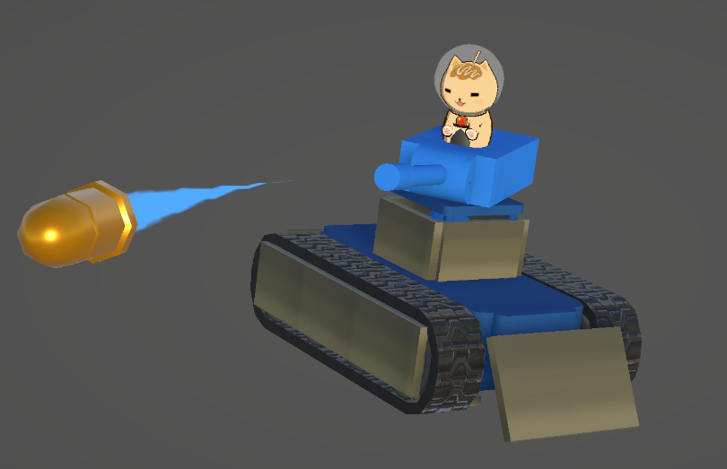

- 出撃コスト　：168 pts
- 出撃可能回数：６回
- 砲塔数　　　：１基
- 回転部位　　：０基
- 装甲数　　　：16基
- 戦車質量　　：1090 kg

コストを最小限に抑え、装甲パーツはコリジョンを囲うように配置して即死を免れる。  
かんたんAI作成機能を使って、移動プリセット＝Orbiting Arena、狙う相手は Min Distance にしました。  
自作3Dモデルをアタッチしており、SkinnedMeshならコスト０で、防御効果もありません。  
fbxやテクスチャ、マテリアル、シェーダーが全て成果物のフォルダ内に収まっていることの参考にしてください。  

---

<h3 id="sample09">CB（Assets/Participant/Sample09）</h3>

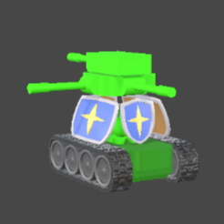

- 出撃コスト　：316 pts
- 出撃可能回数：３回
- 砲塔数　　　：４基
- 回転部位　　：０基
- 装甲数　　　：４基
- 戦車質量　　：1830 kg

ステージ中心をうろつきながら4方向に向かって大砲を発射する、固定砲台風戦車AI。

---

## 使用できる関数

<h3 id="func01">SXG_GetCountOfMyTurrets</h3>

int SXG_GetCountOfMyTurrets();

自分の戦車の砲台の数を取得します。

---

<h3 id="func02">SXG_GetCountOfMyRotJoints</h3>

int SXG_GetCountOfMyRotJoints();

自分の戦車の回転ジョイントの数を取得します。

---

<h3 id="func13">SXG_GetHitObstacles</h3>

Vector3[] SXG_GetHitObstacles(float searchLength);

- searchLength : 探索距離（半径）

自分の戦車を中心に、周囲の障害物（岩）の座標を取得します。  
ステージ中央の大きな岩に加え、ステージ外周の岩も１メッシュずつ取得します。

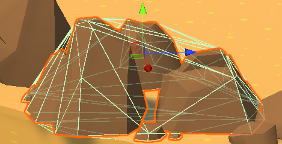

---

<h3 id="func03">SXG_SetCaterpillarPower</h3>

void SXG_SetCaterpillarPower(float left, float right);

左右のキャタピラを回転させます。  
それぞれ -1 ～ 1 で、マイナスは後進、プラスは前進です。  
範囲外の数値を入れるとクランプされます。  

---

<h3 id="func04">SXG_Shoot</h3>

void SXG_Shoot(int turretNo);

砲塔番号を指定して砲弾を発射します。  
範囲外の番号を指定するとアサーションが発生します。  

---

<h3 id="func05">SXG_CanShoot</h3>

bool SXG_CanShoot(int turretNo);

砲塔番号を指定して、砲弾を発射可能かどうかのフラグを返します。  
範囲外の番号を指定するとアサーションが発生します。  
クールタイムが考慮されます。  
戻り値がtrueなら発射可能です。  

---

<h3 id="func06">SXG_RotateTurretToDirection</h3>

void SXG_RotateTurretToDirection(int turretId, float yawDir, float pitchDir);

- yawDir : 左右の旋回：-1 ～ +1：右方向がプラス、左方向がマイナス
- pitchDir : 上下の旋回：-1 ～ +1：下方向がプラス、上方向がマイナス

砲塔番号を指定して、ヨー、ピッチの回転方法を指定して砲塔を旋回させます。  
範囲外の番号を指定するとアサーションが発生します。  
砲塔の回転速度には上限があるため、大きな値を指定すると即座に反映はされません。

---

<h3 id="func07">SXG_RotateTurretToAngle</h3>

void SXG_RotateTurretToAngle(int turretId, float yawAngle, float pitchAngle);

砲塔番号を指定して、砲塔のローカル角度（ヨー、ピッチ：-360度～360度）を設定します。  
範囲外の番号を指定するとアサーションが発生します。  
砲塔の回転速度には上限があるため、大きな値を指定すると即座に反映はされません。


---

<h3 id="func08">SXG_RotateTurretToImpactPoint</h3>

void SXG_RotateTurretToImpactPoint(int turretId, Vector3 impactPoint);

砲塔番号を指定して、着弾予定座標を指定して砲塔を旋回させます。  
範囲外の番号を指定するとアサーションが発生します。


---

<h3 id="func09">SXG_RotateJointToDirection</h3>

void SXG_RotateJointToDirection(int jointId, float yawDir);

- yarDir : 左右の旋回：-1 ～ +1：右方向がプラス、左方向がマイナス

ジョイント番号を指定して、ジョイント関節の回転方法を指定して砲塔を旋回させます。　  
範囲外の番号を指定するとアサーションが発生します。  

---

<h3 id="func10">SXG_RotateJointToAngle</h3>

void SXG_RotateJointToAngle(int jointId, float yawAngle);

- yarAngle : 左右の旋回：戦車の正面が0度：右方向がプラス、左方向がマイナス

ジョイント番号を指定して、ローカル角度（ヨー）を指定してジョイントを旋回させます。  
範囲外の番号を指定するとアサーションが発生します。  

---

<h3 id="func11">SXG_GetPositionAndRotation</h3>

SXG_GetPositionAndRotation(out Vector3 position, out Quaternion rotation);

自身の戦車のワールド座標と角度を取得します。  
**transform.position や transform.rotation は使用せず、こちらの関数を使用してください。**

---


<h3 id="func14">SXG_DebugDrawPositionMarker</h3>

void SXG_DebugDrawPositionMarker(Vector3 targetPosition, bool isDraw=true);

デバッグ用に、指定した座標へマーカー（●）を表示します。  
戦車が向かいたい座標や、狙っている座標などを可視化できるため、目標座標の計算が意図通りかどうかを確認できます。

- targetPosition：マーカーを表示するワールド座標
- isDraw：表示するかどうか（省略時はtrue）

**表示される場所**  
- マーカーは **Sceneビュー** と **Gameビュー** の両方に表示されます。

<div align="center">
  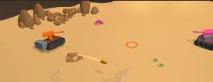
</div>

**注意**  
- この表示はデバッグ用途です。イベント本番では表示されません。  
- 開発中でも、`isDraw=false` を指定すると意図的に非表示にできます。

**使用例**

```C#
private void Update()
{
    Vector3 target = new Vector3(0, 0, 0);
    SXG_DebugDrawPositionMarker(target);
}
```


---


