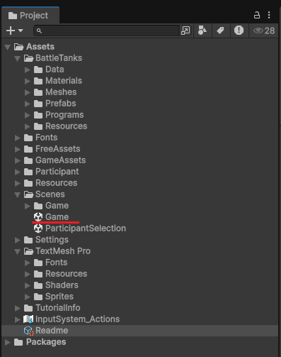
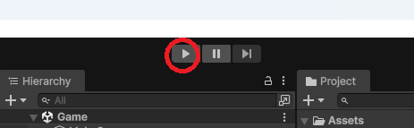

# Unity初心者向け：起動・動作確認ガイド

このページは、Unityに不慣れな方向けに「プロジェクトを開いて、対戦が動くところまで」を案内します。  
Unityの使い方をすべて解説するものではありませんが、イベント参加に必要な最短手順だけをまとめています。

---

## ✅ このページのゴール

1. Unity Hub をインストールします。  
2. Unity **6000.0.65f1** を用意します。  
3. プロジェクトをUnityで開きます。  
4. `Assets/Scenes/Game.unity` を開きます。  
5. Play を押して、対戦が始まることを確認します（Enterキーで進行します）。

---

## 1) Unity Hub をインストールします

まずは Unity Hub をインストールしてください。

- Unity公式ダウンロード（日本語）
  - https://unity.com/ja/download

インストール後、Unity Hub を起動して Unity アカウントでログインしてください（アカウントが無い場合は作成してください）。

 

---

## 2) Unity 6000.0.65f1 を用意します（重要）

このプロジェクトは Unity のバージョンをそろえて開く必要があります。  
Unity **6000.0.65f1** を使用してください。

### 2-1) まずはプロジェクトを開いてみます（おすすめ）

Unity Hub からプロジェクトを開くと、必要に応じて Unity のインストールを案内されることがあります。  
案内が出た場合は、そのまま **6000.0.65f1** をインストールしてください。

### 2-2) 6000.0.65f1 が一覧に出ない場合（Archive）

Unity Hub で目的のバージョンが見つからない場合は、Unity Download Archive から追加してください。

- Unity Download Archive（公式）
  - https://unity.com/releases/editor/archive

※ 補足：Unityのダウンロードに関する日本語の案内ページ（参考）
- Unityをダウンロードするにはどうすればいいですか？（Unityサポート）
  - https://support.unity.com/hc/ja/articles/205637449

 

---

## 3) プロジェクトを Unity Hub で開きます

1. Unity Hub を開きます。  
2. `Add`（追加）を押して、ダウンロードしたプロジェクトフォルダを選択します。  
3. 追加されたプロジェクトをクリックして開きます。  

※ 初回起動はインポートで時間がかかることがあります。

 

---

## 4) Game シーンを開きます（重要）

Unity が開いたら、Project ウィンドウから次のファイルを探して **ダブルクリック**してください。

- `Assets/Scenes/Game.unity`

以下のスクリーンショットの場所にあります。

 

---

## 5) Playで動作確認します（Enterキーで進行します）

1. Unity 上部の **Play** ボタンを押してください。  

2. 対戦者紹介画面が始まります。  
3. 以降、画面を進めるために **Enterキーを適宜押してください**。  
4. 戦車4台の対戦が始まれば動作確認OKです。

 

---

## 困ったとき（よくある対処）

- **Unity のバージョンが違うと言われます**  
  - Unity **6000.0.65f1** をインストールして、そのバージョンでプロジェクトを開いてください。  

- **起動直後にエラーがたくさん出て挙動が不安定です**  
  - Unity を終了し、プロジェクトフォルダ内の `Library` フォルダを削除してから、もう一度開いてください。  

- **プロジェクトの場所（パス）に日本語が含まれています**  
  - `C:\work\...` など、英数字のみの場所に移動してから開き直してください。

 

---

## 補足：動作環境について

運営の動作確認は主に Windows 環境を想定しています。  
Mac でも動作する可能性はありますが、環境差のサポートは限定的になる場合があります。