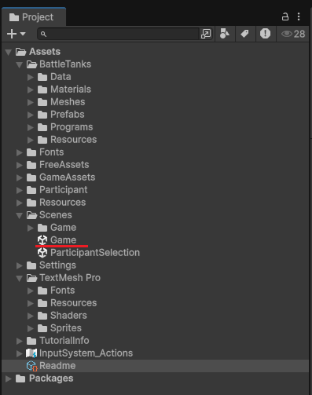
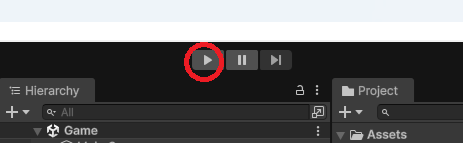

# Unity初心者向け：起動・動作確認ガイド

Unityを初めて使う方向けに、プロジェクトを開いて戦車の対戦を動かすまでの手順を説明します。

---

## ✅ このページのゴール

1. Unity Hubをインストールする。
2. Unity **6000.3.24f1** をインストールする。
3. プロジェクトをUnityで開く。
4. `Assets/Scenes/Game.unity` を開く。
5. Playボタンを押し、スペースキーで画面を進めて対戦を確認する。

---

## 1) Unity Hubをインストールします

Unity公式サイトからUnity Hubをダウンロードしてインストールしてください。

- Unity公式ダウンロード（日本語）
  - https://unity.com/ja/download

インストール後、Unity Hubを起動してUnityアカウントでログインします。アカウントがない場合は作成してください。

 

---

## 2) Unity 6000.3.24f1を用意します（重要）

プロジェクトを開く際は、Unity **6000.3.24f1** を使用してください。

### 2-1) まずはプロジェクトを開いてみます（おすすめ）

Unity Hubでプロジェクトを開く際に、必要なUnityのインストールを案内された場合は、**6000.3.24f1** をインストールしてください。

### 2-2) 6000.3.24f1が一覧に出ない場合（Archive）

Unity Hubで指定のバージョンを見つけられない場合は、公式のUnity Download Archiveから探してください。

- Unity Download Archive（公式）
  - https://unity.com/releases/editor/archive

Unityのダウンロードについては、次のサポート記事も参考にできます。

- Unityをダウンロードするにはどうすればいいですか？（Unityサポート）
  - https://support.unity.com/hc/ja/articles/205637449

 

---

## 3) プロジェクトをUnity Hubで開きます

1. Unity Hubを起動します。
2. `Add`（追加）から、ダウンロードしたプロジェクトのフォルダを選びます。
3. 一覧に追加されたプロジェクトを開きます。

初回はファイルのインポートに時間がかかることがあります。

 

---

## 4) Gameシーンを開きます（重要）

Unityが起動したら、Projectウィンドウで次のファイルを探し、ダブルクリックして開いてください。

- `Assets/Scenes/Game.unity`

 

---

## 5) Playで動作確認します（スペースキーで進行します）

1. Unity画面上部の **Play** ボタンを押します。

   

2. 対戦者紹介画面が表示されたら、**スペースキー**で画面を進めます。
3. 4台の戦車による対戦が始まれば、動作確認は完了です。

 

---

## 困ったとき（よくある対処）

- **Unityのバージョンが違うと言われる場合**  
  Unity **6000.3.24f1** をインストールし、そのバージョンでプロジェクトを開いてください。

- **起動後にエラーが多数表示され、動作が不安定な場合**  
  Unityを終了してからプロジェクト内の `Library` フォルダを削除し、もう一度プロジェクトを開いてください。

- **プロジェクトの保存先に日本語が含まれる場合**  
  `C:\work\...` など、英数字のみのパスへプロジェクトを移してから開き直してください。

 

---

## 補足：動作環境について

運営による動作確認は、主にWindows環境を想定しています。Macでは環境による違いが生じる場合があり、サポートが限定的になることがあります。