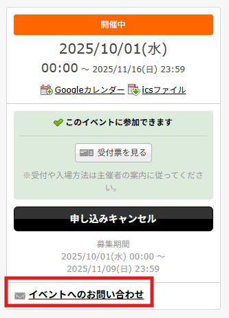

# SXGプログラミングバトル2025 ～スーパータンクウォーズ～

  

## 概要

『Sanuki X Game 2025 』イベントの一般参加企画です。  
**ゲーム内に登場する AI戦車** をみなさんに作成・提出いただき、  
イベント当日、集まったAI戦車たちで **トーナメント(オンライン配信)** を開催します！  

最強の戦車AIを作って応募してみませんか？

### ゲーム内容

ステージ上で戦車を動かし、大砲を撃ち合って戦うゲームです。 
**倒した相手の戦闘力や最後まで生き残ったかどうか** 等でスコアが決まり 
試合終了時に一番高いスコアを獲得したAI戦車の勝利！

- 相手に砲弾を当てて倒したら、倒した敵のコストがポイントとして加算される
- ステージの地形を活かした立ち回りも重要
- 回避や狙い撃ちなど、戦略を工夫して勝利をつかもう！

### 基本ルール
- 一試合4台のAI戦車で対戦
- 一試合の制限時間は2分
- 戦車は「左右のキャタピラ制御（移動）」「砲撃」「パーツ回転」が可能
- 試合終了時に一番スコアの高いAI戦車が勝利 

### 本番の進行方法

- 会場開催 & YoutubeLiveで配信 の想定
- 16人で行うトーナメント形式
- 参加者が多い場合は事前に予選を行って16名に絞り、本番では1回戦と2回戦(決勝)のみを配信
- 参加者へのプレゼントなどはありませんのでご了承ください

## 募集要項

**基礎的なC#プログラミングができれば**  
**年齢・職業・お住まい問わず、全国のどなたでも参加可能です！**  

プロジェクトデータの中にサンプルコードがいくつか入っているので、  
Unity初心者の方でまだプログラミングに不安がある方も、サンプルを見ながらコーディングができますよ。

### 開発環境

- Unity 6000.0.52f1
- 解像度 1920x1080 固定

※このリポジトリのmainブランチをクローンするか 
　ダウンロードして、ローカル環境にUnityプロジェクトを落としてください。

### プロジェクトを落としたら

- **Step 1.　　[『AI作成手順』](Documents/ReadMeFiles/README\_HowToCreate.md) に沿って、早速AIを作成してみましょう！**

- **Step 2.　　[『リファレンス』](Documents/ReadMeFiles/README\_Reference.md) で、AI作成中に役立つ情報を確認しながら作成しましょう！**

- **Step 3.　　[『AI提出手順』](Documents/ReadMeFiles/README\_HowToSubmit.md) に沿って、作成したAIを提出しましょう！**

---

## お問い合わせ

イベントやAI作成に関するお問い合わせは、[connpassのイベントページ](https://connpass.com/event/366668/)内の『イベントへのお問い合わせ』からお願いします。

  
