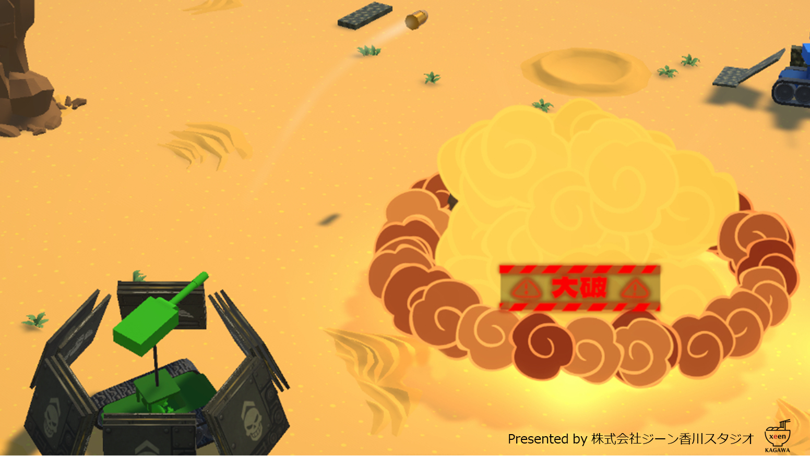
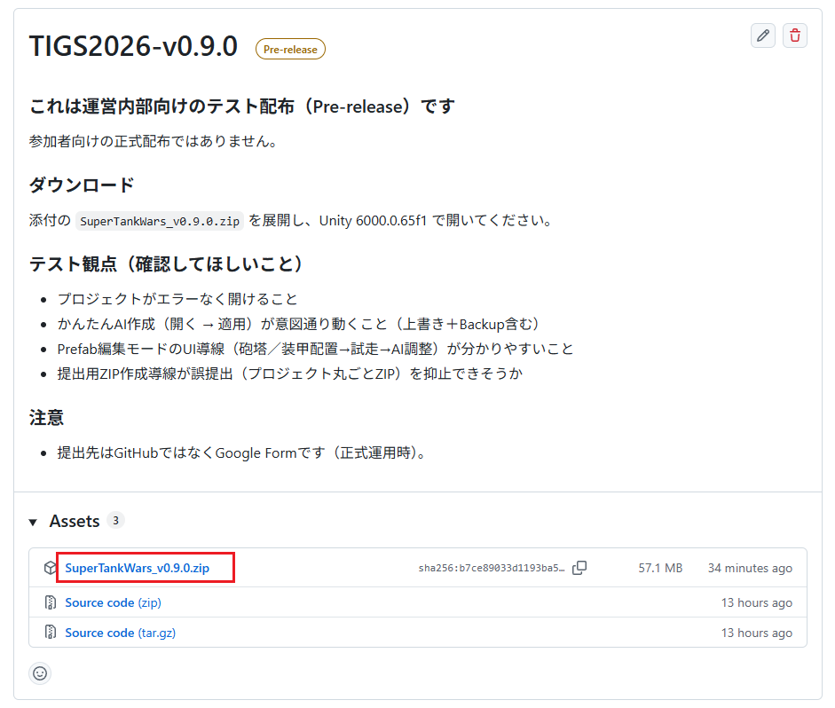

# TIGS2026 プログラミングバトル ～スーパータンクウォーズ～

  

## 概要

本リポジトリは、イベント **TIGS2026** の一般参加企画「スーパータンクウォーズ」プログラミングバトル用のUnityプロジェクトです。  
**ゲーム内に登場するAI戦車** を作成・提出いただき、イベント当日に集まったAI戦車で対戦を行います。

---

## 重要：まずはここから（ダウンロード方法）

### 初めての方（おすすめ）
1. 下のReleases（最新版）を開きます。  
2. **Assets** の `SuperTankWars_v0.9.0.zip` をダウンロードします。  
3. ZIPを展開して、Unity Hubでプロジェクトを開きます。

- Releases（最新版）：  
  https://github.com/SXG-xeen-Kagawa/SuperTankWars-ProgrammingBattle/releases/latest

  

> 補足：すぐに作業を始めたい方は、次の2つを見ると迷いにくいです。  
> - [『AI作成手順』](Documents/ReadMeFiles/README_HowToCreate.md)  
> - [『AI提出手順』](Documents/ReadMeFiles/README_HowToSubmit.md)

### 上級者向け（任意：Gitで取得する）
Gitに慣れている方は、このリポジトリをCloneして使っても構いません。  
更新があった場合はPullで最新版にできます。  
※初めての方はReleasesのZIPを使うほうが簡単です。

---

## 開発環境

- Unity 6000.0.65f1
- 解像度 1920x1080 固定

---

## 進め方（最短手順）

- **Step 1.**　[『AI作成手順』](Documents/ReadMeFiles/README_HowToCreate.md) に沿って、挑戦者（戦車）を作成します。  
- **Step 2.**　[『戦車のカスタマイズ方法』](Documents/ReadMeFiles/README_HowToCustomizeTank.md) を見ながら、砲塔や装甲を追加して試運転します。  
- **Step 3.**　[『リファレンス』](Documents/ReadMeFiles/README_Reference.md) を確認しながら、プログラムを調整します。  
  - プログラムが苦手な人や、アイデアが欲しい人は [『かんたんAI作成機能』](Documents/ReadMeFiles/README_HowToEasyAI.md) もご利用ください。  
- **Step 4.**　[『AI提出手順』](Documents/ReadMeFiles/README_HowToSubmit.md) に沿って、提出用ZIPを作成して提出します。
---

## ゲーム内容（概要）

ステージ上で戦車を動かし、大砲を撃ち合って戦うゲームです。  
**倒した相手の戦闘力や最後まで生き残ったかどうか**等でスコアが決まり、試合終了時に一番スコアを獲得したAI戦車の勝利です。

- 相手に砲弾を当てて倒したら、倒した敵のコストがポイントとして加算されます。
- ステージ外に落下すると大破します（残機が残っていれば復帰します）。
- ステージ中央には障害物があり、地形を活かした立ち回りも重要です。

---

## 募集要項（概要）

**基礎的なC#プログラミングができれば**、年齢・職業・お住まい問わず参加可能です。  
Unity初心者の方でも、サンプルコードや「かんたんAI作成機能」を使って調整できます。

---

## お問い合わせ

イベントやAI作成に関するお問い合わせは、イベントページからお願いします。

- connpassページ：**【後でURLを入れます】**
- 提出フォーム（Google Form）：**【後でURLを入れます】**