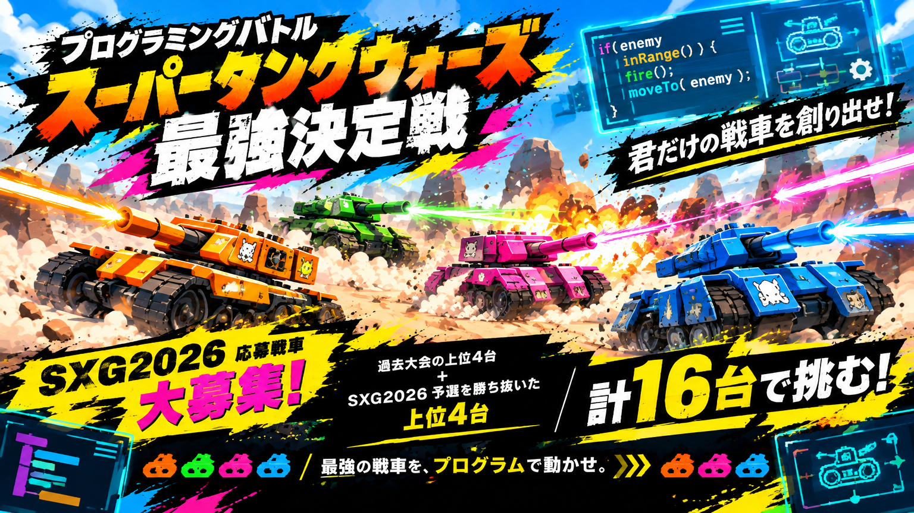
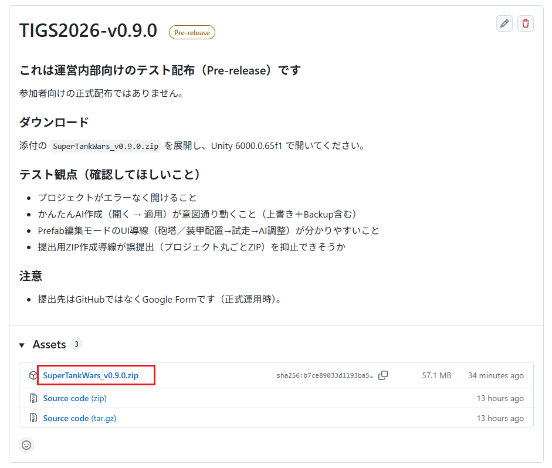

# SXG2026 プログラミングバトル ～スーパータンクウォーズ～

  

## 概要

本リポジトリは、イベント **SXG2026** の一般参加企画「スーパータンクウォーズ」プログラミングバトル用のUnityプロジェクトです。

**ゲーム内に登場するAI戦車**を作成・提出いただき、イベント当日に集まったAI戦車で対戦を行います。

戦車の制作方法は、次の2種類です。

| 制作方法 | 特徴 |
|---|---|
| **Unityプロジェクトで制作する** | Unityエディタで戦車をカスタマイズし、C#でAIをプログラミングできます。より複雑な動きや独自の作戦を実装したい方はこちらをご利用ください。 |
| **ゲーム版で制作する** | Unityのインストールやプログラミングは不要です。ゲーム内の操作でパーツを配置し、戦い方を選んで戦車を作成できます。 |

どちらの方法でも、作成した戦車を提出用ZIPとして出力し、同じ提出フォームから提出できます。

 

---

## 重要：まずはここから（ダウンロード方法）

### Unityプロジェクトで制作する方

Unityエディタで戦車の形をカスタマイズし、C#で戦い方を自由にプログラミングできます。

1. SXG2026向けUnityプロジェクトの配布ページを開きます。
2. **Assets**からSXG2026向けのプロジェクトZIPをダウンロードします。
3. ZIPを展開して、Unity Hubでプロジェクトを開きます。

SXG2026向けUnityプロジェクトの配布ページ：
https://XXX/sxg2026-unity-release

  

※画像はダウンロード操作の例です。ダウンロードするZIPの名前は、SXG2026向け配布ページの案内を確認してください。

Unityに不慣れな方は、プロジェクトを開いて動作確認するまでの手順を先に読むと迷いにくいです。

[『Unity初心者向け：起動・動作確認ガイド』](Documents/ReadMeFiles/README_UnityBeginnerSetup.md)

すぐに制作を始めたい方は、次のページをご確認ください。

[『AI作成手順』](Documents/ReadMeFiles/README_HowToCreate.md) ／ [『戦車の提出手順』](Documents/ReadMeFiles/README_HowToSubmit.md)

公開Unityプロジェクトでは、制作した戦車をサンプル戦車と対戦させて動作確認できます。本番のトーナメント運営機能は含まれていません。

### ゲーム版で制作する方（Unity・プログラミング不要）

Unityやプログラミングを使わずに挑戦したい方には、ゲーム感覚で戦車を作成できるゲーム版も用意しています。

ゲーム内の操作でパーツを配置し、戦い方を選んで戦車を作成できます。完成した戦車は、ゲーム版から提出用ZIPとして出力できます。

[SXG2026向けゲーム版をダウンロード（Google Drive）](https://drive.google.com/drive/folders/1m00FQ0ofT7j6CGE_SOgozsvLqyQAH3VM?usp=drive_link)

リンク先の公開フォルダから、最新版のゲーム版をダウンロードしてください。

ダウンロード、起動、戦車の作成、動作確認、提出用ZIPの出力については、次のページをご確認ください。

[『ゲーム版：ダウンロード・戦車作成・提出ガイド』](Documents/ReadMeFiles/README_GameVersionGuide.md)

ゲーム版には、多くの戦車と戦わせる「連戦シミュレーションモード」や「トーナメントモード」もあります。作った戦車を対戦させながら、形や戦い方を調整してみてください。

### 上級者向け（任意：Gitで取得する）

Gitに慣れている方は、このリポジトリをCloneして使っても構いません。更新があった場合はPullで最新版にできます。

※初めての方は、配布ページからZIPを取得するほうが簡単です。

 

---

## 開発環境

| 項目 | 内容 |
|---|---|
| Unityプロジェクトで制作する場合 | Unity 6000.3.24f1を使用してください。 |
| ゲーム版で制作する場合 | Unityのインストールは不要です。 |
| 解像度 | 1920×1080固定です。 |

ゲーム版の動作環境や起動方法は、[『ゲーム版：ダウンロード・戦車作成・提出ガイド』](Documents/ReadMeFiles/README_GameVersionGuide.md)をご確認ください。

 

---

## 進め方（最短手順）

### Unityプロジェクトで制作する場合

1. connpassでSXG2026にエントリーし、受付番号を確認します。
2. [『AI作成手順』](Documents/ReadMeFiles/README_HowToCreate.md)に沿って、挑戦者（戦車）を作成します。
3. [『戦車のカスタマイズ方法』](Documents/ReadMeFiles/README_HowToCustomizeTank.md)を見ながら、砲塔や装甲を追加して試運転します。
4. [『リファレンス』](Documents/ReadMeFiles/README_Reference.md)を確認しながら、C#で戦い方を調整します。
5. [『戦車の提出手順』](Documents/ReadMeFiles/README_HowToSubmit.md)に沿って、提出用ZIPを作成して提出します。

プログラムが苦手な方や、アイデアが欲しい方は、[『かんたんAI作成機能』](Documents/ReadMeFiles/README_HowToEasyAI.md)もご利用ください。

### ゲーム版で制作する場合

1. connpassでSXG2026にエントリーし、受付番号を確認します。
2. [『ゲーム版：ダウンロード・戦車作成・提出ガイド』](Documents/ReadMeFiles/README_GameVersionGuide.md)に沿って、ゲーム版をダウンロードして起動します。
3. 戦車を作成し、パーツの配置や戦い方を調整します。
4. 対戦で動作を確認し、必要に応じて戦車を調整します。
5. ゲーム版から提出用ZIPを出力し、[『戦車の提出手順』](Documents/ReadMeFiles/README_HowToSubmit.md)に沿って提出します。

 

---

## ゲーム内容（概要）

ステージ上で戦車を動かし、大砲を撃ち合って戦うゲームです。

**倒した相手の戦車の出撃コストと、試合終了時の残機ボーナス**でスコアが決まり、最もスコアを獲得したAI戦車の勝利です。

- 相手に砲弾を当てて倒したら、倒した敵の出撃コストがポイントとして加算されます。
- ステージ外に落下すると大破します。残りのコストで出撃できれば復帰します。
- ステージ中央には障害物があり、地形を活かした立ち回りも重要です。
- SXG2026では、上空に留まり続けて戦闘を避ける戦車への対策として、上空にいる戦車をステージ中央方向へ吹き飛ばすルールを追加しています。

詳しいゲームルールは、[『リファレンス』](Documents/ReadMeFiles/README_Reference.md)をご確認ください。

 

---

## 募集要項（概要）

SXG2026への参加エントリーは**connpassのみ**で受け付けます。戦車を作成するときは、エントリー後に発行される受付番号を使用してください。

年齢・職業・お住まいを問わず参加可能です。

Unityプロジェクトで制作する場合は、Unityエディタで戦車をカスタマイズし、C#でAIをプログラミングします。サンプルコードや「かんたんAI作成機能」も利用できます。

Unityやプログラミングが初めての方は、ゲーム版で戦車を制作して参加することもできます。

- 募集開始予定：2026年10月1日
- イベント開催予定：2026年11月15日
- 提出締切：2026年11月8日（日）23:59
- connpassページ：https://connpass.com/event/408297/
- 提出フォーム：https://forms.gle/DuWm4o32XAxjv1a16

 

---

## お問い合わせ

イベントや戦車の作成に関するお問い合わせは、イベントページからお願いします。

connpassページ：https://connpass.com/event/408297/

 

---

## 🔗 関連リンク（PV・公式記事など）

- PV（まずはこちら）：https://youtu.be/TrEf7w3QpWI
- チャンネル：https://www.youtube.com/@xeenjp
- 公式X：https://x.com/xeenjp
- 2026-02-12：TIGS2026 プロバト参加者募集：https://www.xeen.co.jp/staffblog/2026/02/staffblog-20250212.html
- 2025-10-01：SXG2025 出展紹介：https://www.xeen.co.jp/staffblog/2025/10/blog-20251001.html
- 2025-11-19：イベントレポート：https://www.xeen.co.jp/staffblog/2025/11/staffblog-20251119.html